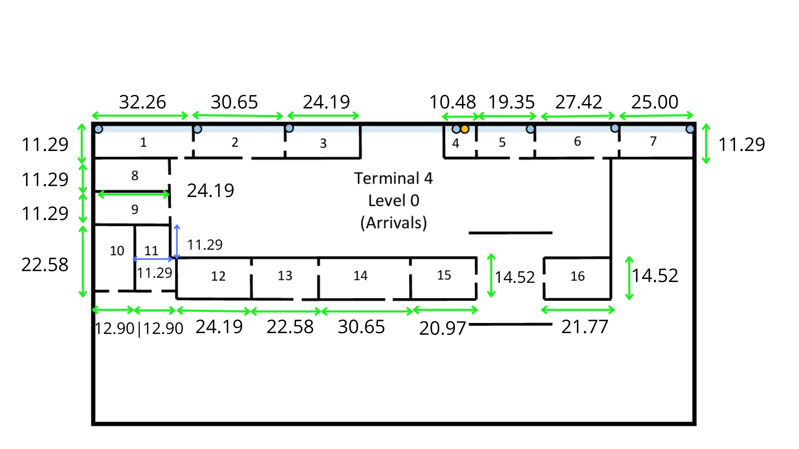
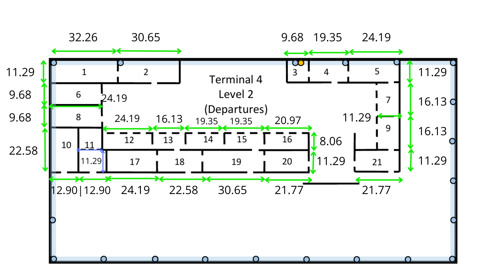
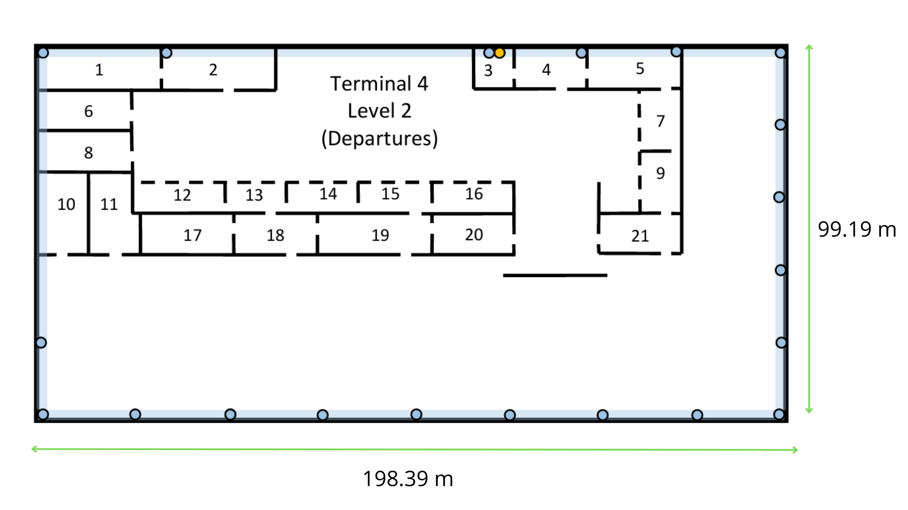
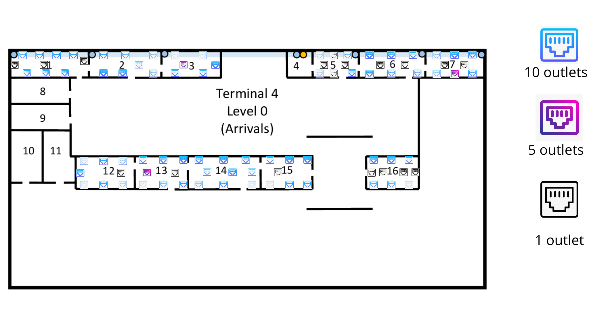
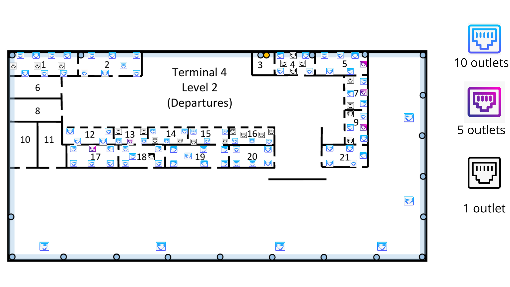
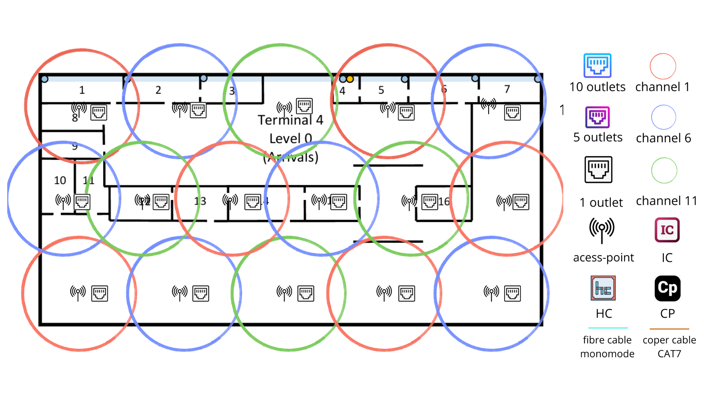
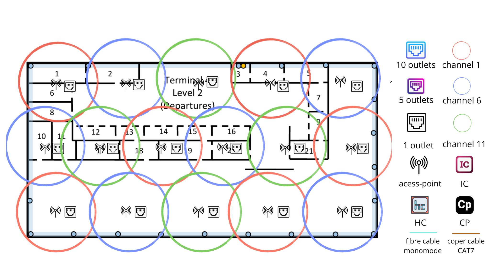

# Sprint 1 - Terminal 4 - 1240895

## Informações Gerais

O edifício do **Terminal 4** tem dimensões aproximadas de 200m x 100m. O presente projeto abrange o **Piso 0 (Chegadas)** e o **Piso 2 (Partidas)**.

Ambos os pisos deverão garantir cobertura de rede local sem fios (**Wireless LAN – Wi-Fi**).

---

## 1. Requisitos Técnicos

### Level 0 - Arrivals

- Existe uma única conduta vertical de cabos localizada na **Sala 4**, que estabelece ligação direta à passagem subterrânea exterior.
- A distância vertical entre este piso e o ponto de ligação à passagem subterrânea exterior é de **3 metros**.
- O teto do piso encontra-se a **5 metros do chão**, com um **teto falso a 4 metros**. O espaço técnico acima do teto falso é utilizado para caminhos de cabos e instalação de Access Points.

#### Tomadas de Rede

- As salas **1, 2, 3, 5, 6, 7, 12, 13, 14, 15 e 16** deverão possuir o número padrão de tomadas de rede.
- As salas **4, 8, 9, 10 e 11** não necessitam de tomadas de rede.
- A **Sala 4** é a única adequada para a instalação de equipamentos de infraestrutura de rede (IC/HC).

### Level 2 - Departures

- A distância vertical entre este piso e o ponto de ligação à passagem subterrânea exterior (via Sala 4 do Piso 0) é de **15 metros**.
- O teto do piso encontra-se a **5 metros do chão**, com um **teto falso a 4 metros**.

#### Tomadas de Rede

- As salas **1, 2, 4, 5, 7, 9, 12, 13, 14, 15, 16, 17, 18, 19, 20 e 21** deverão possuir o número padrão de tomadas de rede.
- As salas **3, 6, 8, 10 e 11** não necessitam de tomadas de rede.
- A **Sala 3** é adequada para a instalação de equipamentos de infraestrutura de rede (HC).

#### Tomadas ao Longo das Paredes Exteriores

- Deverá ser instalada **uma tomada de rede (ISO 8877) a cada 5 metros** ao longo da parede exterior direita e da parede exterior inferior.

---

## 2. Dimensionamento das Tomadas de Rede

O número de tomadas foi calculado considerando a regra de **2 tomadas por cada 10 m²** (arredondado por excesso), utilizando a escala de $3,1 \text{ cm} = 50 \text{ m}$ (onde $1 \text{ cm} \approx 16,13 \text{ m}$).

Fórmula utilizada: Outlets = $\lceil \frac{\text{Área (m²)}}{10} \times 2 \rceil$

---

## 3. Medidas das Salas e Outlets

### Level 0 - Arrivals

| Sala | Medidas (cm)        | Dimensões Reais (m)      | Área (m²) | Outlets | Notas                  |
| ---- | ------------------- | ------------------------- | ----------- | ------- | ---------------------- |
| 1    | 2,0 x 0,7           | 32,26 x 11,29             | 364,21      | 73      |                        |
| 2    | 1,9 x 0,7           | 30,65 x 11,29             | 346,03      | 70      |                        |
| 3    | 1,5 x 0,7           | 24,19 x 11,29             | 273,10      | 55      |                        |
| 4    | 0,65 x 0,7          | 10,48 x 11,29             | 118,32      | 0       | Infraestrutura (IC/HC) |
| 5    | 1,2 x 0,7           | 19,35 x 11,29             | 218,46      | 44      |                        |
| 6    | 1,7 x 0,7           | 27,42 x 11,29             | 309,57      | 62      |                        |
| 7    | 1,55 x 0,7          | 25,00 x 11,29             | 282,25      | 57      |                        |
| 8    | 1,5 x 0,7           | 24,19 x 11,29             | 273,10      | 0       | Sem tomadas            |
| 9    | 1,5 x 0,7           | 24,19 x 11,29             | 273,10      | 0       | Sem tomadas            |
| 10   | 1,4 x 0,8           | 22,58 x 12,90             | 291,28      | 0       | Sem tomadas            |
| 11   | (0,8x0,7)+(0,7x0,7) | 12,90x11,29 + 11,29x11,29 | 273,10      | 0       | Sem tomadas            |
| 12   | 1,5 x 0,9           | 24,19 x 14,52             | 351,24      | 71      |                        |
| 13   | 1,4 x 0,9           | 22,58 x 14,52             | 327,86      | 66      |                        |
| 14   | 1,9 x 0,9           | 30,65 x 14,52             | 445,04      | 90      |                        |
| 15   | 1,3 x 0,9           | 20,97 x 14,52             | 304,48      | 61      |                        |
| 16   | 1,35 x 0,9          | 21,78 x 14,52             | 316,25      | 64      |                        |

**Total Outlets Piso 0 (Salas): 713**

### Level 2 - Departures

| Sala | Medidas (cm)        | Dimensões Reais (m)      | Área (m²) | Outlets | Notas               |
| ---- | ------------------- | ------------------------- | ----------- | ------- | ------------------- |
| 1    | 2,0 x 0,7           | 32,26 x 11,29             | 364,21      | 73      |                     |
| 2    | 1,9 x 0,7           | 30,65 x 11,29             | 346,03      | 70      |                     |
| 3    | 0,6 x 0,7           | 9,68 x 11,29              | 109,21      | 0       | Infraestrutura (HC) |
| 4    | 1,2 x 0,7           | 19,35 x 11,29             | 218,46      | 44      |                     |
| 5    | 1,5 x 0,7           | 24,19 x 11,29             | 273,10      | 55      |                     |
| 6    | 1,5 x 0,6           | 24,19 x 9,68              | 234,08      | 0       | Sem tomadas         |
| 7    | 0,7 x 1,0           | 11,29 x 16,13             | 182,11      | 37      |                     |
| 8    | 1,5 x 0,6           | 24,19 x 9,68              | 234,08      | 0       | Sem tomadas         |
| 9    | 0,7 x 1,0           | 11,29 x 16,13             | 182,11      | 37      |                     |
| 10   | 0,8 x 1,35          | 12,90 x 22.58             | 281,00      | 0       | Sem tomadas         |
| 11   | (0,8x0,7)+(0,7x0,7) | 12,90x11,29 + 11,29x11,29 | 273,10      | 0       | Sem tomadas         |
| 12   | 1,5 x 0,5           | 24,19 x 8,06              | 195,05      | 40      |                     |
| 13   | 1,0 x 0,5           | 16,13 x 8,06              | 130,05      | 27      |                     |
| 14   | 1,2 x 0,5           | 19,35 x 8,06              | 156,05      | 32      |                     |
| 15   | 1,2 x 0,5           | 19,35 x 8,06              | 156,05      | 32      |                     |
| 16   | 1,3 x 0,5           | 20,97 x 8,06              | 169,05      | 34      |                     |
| 17   | 1,5 x 0,7           | 24,19 x 11,29             | 273,10      | 55      |                     |
| 18   | 1,4 x 0,7           | 22,58 x 11,29             | 254,90      | 51      |                     |
| 19   | 1,9 x 0,7           | 30,65 x 11,29             | 346,03      | 70      |                     |
| 20   | 1,35 x 0,7          | 21,77 x 11,29             | 245,80      | 50      |                     |
| 21   | 1,35 x 0,7          | 21,77 x 11,29             | 245,80      | 50      |                     |

**Total Outlets Piso 2 (Salas): 807**

---

---

## 4. Tomadas nas Paredes Exteriores (Level 2)

As dimensões reais do piso são:

- **Level 2 – Departures:** 198,39 m × 99,19 m

Aplicando a regra de uma tomada a cada 5 metros:

Outlets = $\left\lceil \frac{\text{Comprimento útil da parede}}{5} \right\rceil$

### Level 2 - Departures

- Parede inferior: 40 tomadas
- Parede direita: 20 tomadas
- Total paredes externas: 60 tomadas

## Posicionamento das tomadas de rede

### Level 0 - Arrivals

### Level 2 - Departures

## 5. Pontos de Acesso Wireless (Wi-Fi)

Ambos os pisos do Terminal 2 requerem cobertura de rede sem fios.

Cada Wireless Access Point (WAP) garante uma cobertura circular aproximada com **50 metros de diâmetro (25 metros de raio)**.

### Cálculo da Área de Cobertura

A área de cobertura de cada WAP pode ser estimada através da expressão:
A = πr² (Onde: r = 25 m)

Logo:
A ≈ 3.14 × 25² ≈ 1963 m²

### Número de WAPs Necessários

A área total aproximada de cada piso é:
200 × 100 = 20000 m²

Número mínimo de WAPs:
N = Área do piso / Área de cobertura do WAP
N = 20000 / 1963
N ≈ **10.19**

Arredondando por excesso:
N ≈ **11 WAPs**

### Ajuste para Condições Reais

O valor anterior corresponde apenas a um cenário **teórico ideal**, assumindo cobertura circular perfeita e ausência de obstáculos.
Na prática, diversos fatores reduzem a eficácia da cobertura:

- Atenuação do sinal provocada por **paredes, pilares e estruturas metálicas**
- **Elevada densidade de utilizadores** típica de um terminal aeroportuário
- Necessidade de **sobreposição entre células Wi-Fi** para permitir roaming contínuo
- Planeamento de canais para evitar interferências entre pontos de acesso

Para compensar estes fatores, foi aplicado um **fator de segurança de aproximadamente 40%**.

Cálculo:
N_real = 11 × 1.4
N_real ≈ **15.4**

Arredondando por excesso:
N_real ≈ **16 WAPs por piso**

### Posicionamento no teto falso

#### Level 1 - Arrivals

**Nota**: Cada WAP requer uma **tomada de rede RJ45 (ISO 8877)** instalada no **teto falso**, localizado a 4 metros de altura.

#### Level 4 - Departures

**Nota**: Cada WAP requer uma **tomada de rede RJ45 (ISO 8877)** instalada no **teto falso**, localizado a 4 metros de altura.

---
