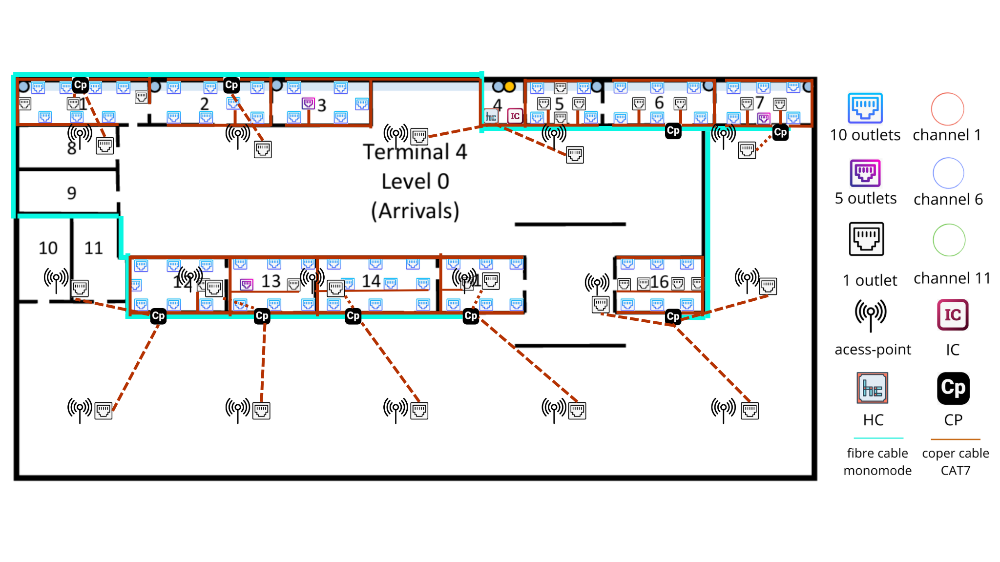
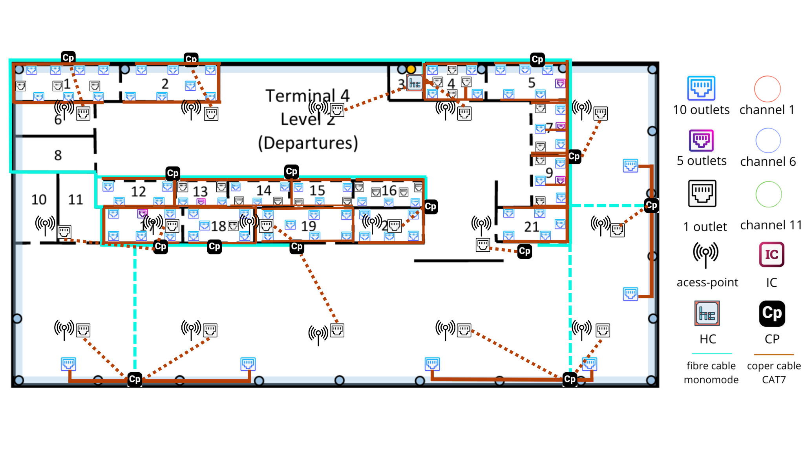

# Sprint 1 - Terminal 4 - 1240895

## Informações Gerais

O edifício do **Terminal 4** tem dimensões aproximadas de 200m x 100m. O presente projeto abrange o **Piso 0 (Chegadas)** e o **Piso 2 (Partidas)**.

Ambos os pisos deverão garantir cobertura de rede local sem fios (**Wireless LAN – Wi-Fi**).

---

## 1. Requisitos Técnicos

### Level 0 - Arrivals

- Existe uma única conduta vertical de cabos localizada na **Sala 4**, que estabelece ligação direta à passagem subterrânea exterior.
- A distância vertical entre este piso e o ponto de ligação à passagem subterrânea exterior é de **3 metros**.
- O teto do piso encontra-se a **5 metros do chão**, com um **teto falso a 4 metros**. O espaço técnico acima do teto falso é utilizado para caminhos de cabos e instalação de Access Points.

#### Tomadas de Rede

- As salas **1, 2, 3, 5, 6, 7, 12, 13, 14, 15 e 16** deverão possuir o número padrão de tomadas de rede.
- As salas **4, 8, 9, 10 e 11** não necessitam de tomadas de rede.
- A **Sala 4** é a única adequada para a instalação de equipamentos de infraestrutura de rede (IC/HC).

### Level 2 - Departures

- A distância vertical entre este piso e o ponto de ligação à passagem subterrânea exterior (via Sala 4 do Piso 0) é de **15 metros**.
- O teto do piso encontra-se a **5 metros do chão**, com um **teto falso a 4 metros**.

#### Tomadas de Rede

- As salas **1, 2, 4, 5, 7, 9, 12, 13, 14, 15, 16, 17, 18, 19, 20 e 21** deverão possuir o número padrão de tomadas de rede.
- As salas **3, 6, 8, 10 e 11** não necessitam de tomadas de rede.
- A **Sala 3** é adequada para a instalação de equipamentos de infraestrutura de rede (HC).

#### Tomadas ao Longo das Paredes Exteriores

- Deverá ser instalada **uma tomada de rede (ISO 8877) a cada 5 metros** ao longo da parede exterior direita e da parede exterior inferior.

---

## 2. Dimensionamento das Tomadas de Rede

O número de tomadas foi calculado considerando a regra de **2 tomadas por cada 10 m²** (arredondado por excesso), utilizando a escala de $3,1 \text{ cm} = 50 \text{ m}$ (onde $1 \text{ cm} \approx 16,13 \text{ m}$).

Fórmula utilizada: Outlets = $\lceil \frac{\text{Área (m²)}}{10} \times 2 \rceil$

---

## 3. Medidas das Salas e Outlets

### Level 0 - Arrivals

| Sala | Medidas (cm)        | Dimensões Reais (m)      | Área (m²) | Outlets | Notas                  |
| ---- | ------------------- | ------------------------- | ----------- | ------- | ---------------------- |
| 1    | 2,0 x 0,7           | 32,26 x 11,29             | 364,21      | 73      |                        |
| 2    | 1,9 x 0,7           | 30,65 x 11,29             | 346,03      | 70      |                        |
| 3    | 1,5 x 0,7           | 24,19 x 11,29             | 273,10      | 55      |                        |
| 4    | 0,65 x 0,7          | 10,48 x 11,29             | 118,32      | 0       | Infraestrutura (IC/HC) |
| 5    | 1,2 x 0,7           | 19,35 x 11,29             | 218,46      | 44      |                        |
| 6    | 1,7 x 0,7           | 27,42 x 11,29             | 309,57      | 62      |                        |
| 7    | 1,55 x 0,7          | 25,00 x 11,29             | 282,25      | 57      |                        |
| 8    | 1,5 x 0,7           | 24,19 x 11,29             | 273,10      | 0       | Sem tomadas            |
| 9    | 1,5 x 0,7           | 24,19 x 11,29             | 273,10      | 0       | Sem tomadas            |
| 10   | 1,4 x 0,8           | 22,58 x 12,90             | 291,28      | 0       | Sem tomadas            |
| 11   | (0,8x0,7)+(0,7x0,7) | 12,90x11,29 + 11,29x11,29 | 273,10      | 0       | Sem tomadas            |
| 12   | 1,5 x 0,9           | 24,19 x 14,52             | 351,24      | 71      |                        |
| 13   | 1,4 x 0,9           | 22,58 x 14,52             | 327,86      | 66      |                        |
| 14   | 1,9 x 0,9           | 30,65 x 14,52             | 445,04      | 90      |                        |
| 15   | 1,3 x 0,9           | 20,97 x 14,52             | 304,48      | 61      |                        |
| 16   | 1,35 x 0,9          | 21,78 x 14,52             | 316,25      | 64      |                        |

**Total Outlets Piso 0 (Salas): 713**

### Level 2 - Departures

| Sala | Medidas (cm)        | Dimensões Reais (m)      | Área (m²) | Outlets | Notas               |
| ---- | ------------------- | ------------------------- | ----------- | ------- | ------------------- |
| 1    | 2,0 x 0,7           | 32,26 x 11,29             | 364,21      | 73      |                     |
| 2    | 1,9 x 0,7           | 30,65 x 11,29             | 346,03      | 70      |                     |
| 3    | 0,6 x 0,7           | 9,68 x 11,29              | 109,21      | 0       | Infraestrutura (HC) |
| 4    | 1,2 x 0,7           | 19,35 x 11,29             | 218,46      | 44      |                     |
| 5    | 1,5 x 0,7           | 24,19 x 11,29             | 273,10      | 55      |                     |
| 6    | 1,5 x 0,6           | 24,19 x 9,68              | 234,08      | 0       | Sem tomadas         |
| 7    | 0,7 x 1,0           | 11,29 x 16,13             | 182,11      | 37      |                     |
| 8    | 1,5 x 0,6           | 24,19 x 9,68              | 234,08      | 0       | Sem tomadas         |
| 9    | 0,7 x 1,0           | 11,29 x 16,13             | 182,11      | 37      |                     |
| 10   | 0,8 x 1,35          | 12,90 x 22.58             | 281,00      | 0       | Sem tomadas         |
| 11   | (0,8x0,7)+(0,7x0,7) | 12,90x11,29 + 11,29x11,29 | 273,10      | 0       | Sem tomadas         |
| 12   | 1,5 x 0,5           | 24,19 x 8,06              | 195,05      | 40      |                     |
| 13   | 1,0 x 0,5           | 16,13 x 8,06              | 130,05      | 27      |                     |
| 14   | 1,2 x 0,5           | 19,35 x 8,06              | 156,05      | 32      |                     |
| 15   | 1,2 x 0,5           | 19,35 x 8,06              | 156,05      | 32      |                     |
| 16   | 1,3 x 0,5           | 20,97 x 8,06              | 169,05      | 34      |                     |
| 17   | 1,5 x 0,7           | 24,19 x 11,29             | 273,10      | 55      |                     |
| 18   | 1,4 x 0,7           | 22,58 x 11,29             | 254,90      | 51      |                     |
| 19   | 1,9 x 0,7           | 30,65 x 11,29             | 346,03      | 70      |                     |
| 20   | 1,35 x 0,7          | 21,77 x 11,29             | 245,80      | 50      |                     |
| 21   | 1,35 x 0,7          | 21,77 x 11,29             | 245,80      | 50      |                     |

**Total Outlets Piso 2 (Salas): 807**

---

---

## 4. Tomadas nas Paredes Exteriores (Level 2)

As dimensões reais do piso são:

- **Level 2 – Departures:** 198,39 m × 99,19 m

Aplicando a regra de uma tomada a cada 5 metros:

Outlets = $\left\lceil \frac{\text{Comprimento útil da parede}}{5} \right\rceil$

### Level 2 - Departures

- Parede inferior: 40 tomadas
- Parede direita: 20 tomadas
- Total paredes externas: 60 tomadas

## Posicionamento das tomadas de rede

### Level 0 - Arrivals

### Level 2 - Departures

## 5. Pontos de Acesso Wireless (Wi-Fi)

Ambos os pisos do Terminal 2 requerem cobertura de rede sem fios.

Cada Wireless Access Point (WAP) garante uma cobertura circular aproximada com **50 metros de diâmetro (25 metros de raio)**.

### Cálculo da Área de Cobertura

A área de cobertura de cada WAP pode ser estimada através da expressão:
A = πr² (Onde: r = 25 m)

Logo:
A ≈ 3.14 × 25² ≈ 1963 m²

### Número de WAPs Necessários

A área total aproximada de cada piso é:
200 × 100 = 20000 m²

Número mínimo de WAPs:
N = Área do piso / Área de cobertura do WAP
N = 20000 / 1963
N ≈ **10.19**

Arredondando por excesso:
N ≈ **11 WAPs**

### Ajuste para Condições Reais

O valor anterior corresponde apenas a um cenário **teórico ideal**, assumindo cobertura circular perfeita e ausência de obstáculos.
Na prática, diversos fatores reduzem a eficácia da cobertura:

- Atenuação do sinal provocada por **paredes, pilares e estruturas metálicas**
- **Elevada densidade de utilizadores** típica de um terminal aeroportuário
- Necessidade de **sobreposição entre células Wi-Fi** para permitir roaming contínuo
- Planeamento de canais para evitar interferências entre pontos de acesso

Para compensar estes fatores, foi aplicado um **fator de segurança de aproximadamente 40%**.

Cálculo:
N_real = 11 × 1.4
N_real ≈ **15.4**

Arredondando por excesso:
N_real ≈ **16 WAPs por piso**

### Posicionamento no teto falso

#### Level 1 - Arrivals

**Nota**: Cada WAP requer uma **tomada de rede RJ45 (ISO 8877)** instalada no **teto falso**, localizado a 4 metros de altura.

#### Level 4 - Departures

**Nota**: Cada WAP requer uma **tomada de rede RJ45 (ISO 8877)** instalada no **teto falso**, localizado a 4 metros de altura.

---

## 6. Hierarquia e Localização dos Distribuidores

O projeto de cablagem estruturada segue uma arquitetura hierárquica:

$$\text{MC} \rightarrow \text{IC} \rightarrow \text{HC} \xrightarrow{\text{fibra OM4}} \text{CP} \xrightarrow{\text{CAT7 cobre}} \text{Outlets}$$

Esta estrutura permite uma distribuição eficiente da rede, respeitando as limitações técnicas da cablagem horizontal e facilitando a gestão da infraestrutura. Foi adotado **1 HC por piso**, opção justificada pelo facto de o enunciado designar apenas uma sala técnica por piso (Sala 4 no Level 0, Sala 3 no Level 2). Com a ligação HC→CP em fibra ótica, a distância ao HC deixa de ser um fator limitante, tornando desnecessário um segundo HC.

---

### Level 0 – Arrivals

---

### Sala 4 – Núcleo de Distribuição do Terminal 4

A **Sala 4** foi selecionada como o principal ponto de distribuição do Terminal 4 por possuir a **única conduta vertical de cabos** do edifício (identificada na planta pelo ponto amarelo), com ligação direta à galeria técnica subterrânea do campus (distância vertical: **3 metros**).

Nesta sala encontram-se instalados:

- **Intermediate Cross-Connect (IC):** distribuidor central do edifício, recebe a ligação proveniente do MC (Terminal 2, Sala 12, Level 1) e distribui conectividade para os HCs do Terminal 4.
- **Horizontal Cross-Connect (HC – Sala 4):** responsável por distribuir fibra ótica OM4 para todos os Consolidation Points do Level 0. As **Salas 3 e 5**, pela sua proximidade à Sala 4, são servidas diretamente pelo HC sem necessidade de CP intermédio.

#### HC + IC – Sala 4

| Componente | Tipo | Espaço |
|---|---|---|
| Patch panel fibra OM4 | 24 portas, 1U | 1U |

Espaço total ocupado: **1U**

Para alojar o IC, HC, equipamentos ativos (switches, UPS) e espaço de expansão futura foi selecionado um **rack de 42U**.

---

### Estratégia de Consolidation Points (CPs) – Level 0

Devido às dimensões do piso (**aproximadamente 198 × 99 metros**) e à limitação de **90 metros de cabo horizontal em cobre**, foram implementados **Consolidation Points (CPs)** distribuídos pelo piso.

Os CPs permitem:
- reduzir o número de cabos de cobre diretos ligados ao HC
- manter todas as distâncias dentro dos limites da cablagem estruturada
- distribuir melhor a densidade de tomadas
- simplificar futuras reconfigurações da rede

A ligação **HC → CP** é realizada por **fibra ótica OM4**. A ligação **CP → outlets** é realizada por **cabo de cobre CAT7** (máximo 90 metros).

---

### Zona Superior (Salas 1, 2, 6 e 7)

| Sala | Outlets |
|------|---------|
| Sala 1 | 74 |
| Sala 2 | 71 |
| Sala 6 | 62 |
| Sala 7 | 58 |

#### CP – Sala 1

Número de ligações: **74**

| Patch Panel | Portas | Espaço |
|---|---|---|
| Patch Panel | 48 portas | 2U |
| Patch Panel | 48 portas | 2U |

Espaço total ocupado: **4U** → 4 × 4 = 16U → **rack de 24U**

---

#### CP – Sala 2

Número de ligações: **71**

| Patch Panel | Portas | Espaço |
|---|---|---|
| Patch Panel | 48 portas | 2U |
| Patch Panel | 24 portas | 1U |

Espaço total ocupado: **3U** → 4 × 3 = 12U → **rack de 12U**

---

#### CP – Sala 6

Número de ligações: **62**

| Patch Panel | Portas | Espaço |
|---|---|---|
| Patch Panel | 48 portas | 2U |
| Patch Panel | 24 portas | 1U |

Espaço total ocupado: **3U** → 4 × 3 = 12U → **rack de 12U**

---

#### CP – Sala 7

Número de ligações: **58**

| Patch Panel | Portas | Espaço |
|---|---|---|
| Patch Panel | 48 portas | 2U |
| Patch Panel | 24 portas | 1U |

Espaço total ocupado: **3U** → 4 × 3 = 12U → **rack de 12U**

---

### Zona Inferior (Salas 12, 13, 14, 15 e 16)

| Sala | Outlets |
|------|---------|
| Sala 12 | 73 |
| Sala 13 | 68 |
| Sala 14 | 91 |
| Sala 15 | 63 |
| Sala 16 | 67 |

#### CP – Sala 12

Número de ligações: **73**

| Patch Panel | Portas | Espaço |
|---|---|---|
| Patch Panel | 48 portas | 2U |
| Patch Panel | 24 portas | 1U |

Espaço total ocupado: **3U** → 4 × 3 = 12U → **rack de 12U**

---

#### CP – Sala 13

Número de ligações: **68**

| Patch Panel | Portas | Espaço |
|---|---|---|
| Patch Panel | 48 portas | 2U |
| Patch Panel | 24 portas | 1U |

Espaço total ocupado: **3U** → 4 × 3 = 12U → **rack de 12U**

---

#### CP – Sala 14

Número de ligações: **91**

| Patch Panel | Portas | Espaço |
|---|---|---|
| Patch Panel | 48 portas | 2U |
| Patch Panel | 48 portas | 2U |

Espaço total ocupado: **4U** → 4 × 4 = 16U → **rack de 24U**

---

#### CP – Sala 15

Número de ligações: **63**

| Patch Panel | Portas | Espaço |
|---|---|---|
| Patch Panel | 48 portas | 2U |
| Patch Panel | 24 portas | 1U |

Espaço total ocupado: **3U** → 4 × 3 = 12U → **rack de 12U**

---

#### CP – Sala 16

Número de ligações: **67**

| Patch Panel | Portas | Espaço |
|---|---|---|
| Patch Panel | 48 portas | 2U |
| Patch Panel | 24 portas | 1U |

Espaço total ocupado: **3U** → 4 × 3 = 12U → **rack de 12U**

### Level 2 – Departures

---

### Sala 3 – Distribuição Principal do Level 2

A **Sala 3** foi selecionada como o principal ponto de distribuição deste piso por possuir **passagens verticais de cabos** (identificadas na planta pelo ponto amarelo), permitindo a ligação direta ao **Intermediate Cross-Connect (IC)** localizado na Sala 4 do Level 0.

Nesta sala encontra-se instalado um **Horizontal Cross-Connect (HC)** responsável por distribuir fibra ótica OM4 para todos os Consolidation Points do Level 2. As **Salas 4** e áreas próximas são servidas diretamente pelo HC, com **26 tomadas de rede locais**.

#### HC – Sala 3

| Patch Panel | Portas | Espaço |
|---|---|---|
| Patch Panel fibra OM4 | 24 portas | 1U |

Espaço total ocupado: **1U** → 4 × 1 = 4U → **rack de 6U**

---

### Estratégia de Consolidation Points (CPs) – Level 2

Devido às dimensões do piso (**aproximadamente 198 × 99 metros**) e à limitação de **90 metros de cabo horizontal em cobre**, foram implementados **Consolidation Points (CPs)** distribuídos estrategicamente pelo piso.

A ligação **HC → CP** é realizada por **fibra ótica OM4**. A ligação **CP → outlets** é realizada por **cabo de cobre CAT7** (máximo 90 metros).

---

### Zona Superior (Salas 1, 2 e 5)

| Localização | Ligações |
|-------------|----------|
| CP – Sala 1 | 74 |
| CP – Sala 2 | 71 |
| CP – Sala 5 | 55 |

#### CP – Sala 1

Número de ligações: **74**

| Patch Panel | Portas | Espaço |
|---|---|---|
| Patch Panel | 48 portas | 2U |
| Patch Panel | 48 portas | 2U |

Espaço total ocupado: **4U** → 4 × 4 = 16U → **rack de 24U**

---

#### CP – Sala 2

Número de ligações: **71**

| Patch Panel | Portas | Espaço |
|---|---|---|
| Patch Panel | 48 portas | 2U |
| Patch Panel | 24 portas | 1U |

Espaço total ocupado: **3U** → 4 × 3 = 12U → **rack de 12U**

---

#### CP – Sala 5

Número de ligações: **55**

| Patch Panel | Portas | Espaço |
|---|---|---|
| Patch Panel | 48 portas | 2U |
| Patch Panel | 24 portas | 1U |

Espaço total ocupado: **3U** → 4 × 3 = 12U → **rack de 12U**

---

### Zona Central Esquerda (Salas 12, 13, 14, 15, 16, 17, 18, 19 e 20)

Foram instalados **6 CPs** responsáveis pela distribuição das tomadas nesta zona.

| CP | Salas servidas | Ligações |
|----|---------------|----------|
| CP1 | Salas 12 e 13 | 67 |
| CP2 | Salas 14 e 15 | 64 |
| CP3 | Salas 16 e 20 | 85 |
| CP4 | Sala 17 | 57 |
| CP5 | Sala 18 | 51 |
| CP6 | Sala 19 | 72 |

#### CP1 – Salas 12 e 13

Número de ligações: **67**

| Patch Panel | Portas | Espaço |
|---|---|---|
| Patch Panel | 48 portas | 2U |
| Patch Panel | 24 portas | 1U |

Espaço total ocupado: **3U** → 4 × 3 = 12U → **rack de 12U**

---

#### CP2 – Salas 14 e 15

Número de ligações: **64**

| Patch Panel | Portas | Espaço |
|---|---|---|
| Patch Panel | 48 portas | 2U |
| Patch Panel | 24 portas | 1U |

Espaço total ocupado: **3U** → 4 × 3 = 12U → **rack de 12U**

---

#### CP3 – Salas 16 e 20

Número de ligações: **85**

| Patch Panel | Portas | Espaço |
|---|---|---|
| Patch Panel | 48 portas | 2U |
| Patch Panel | 48 portas | 2U |

Espaço total ocupado: **4U** → 4 × 4 = 16U → **rack de 24U**

---

#### CP4 – Sala 17

Número de ligações: **57**

| Patch Panel | Portas | Espaço |
|---|---|---|
| Patch Panel | 48 portas | 2U |
| Patch Panel | 24 portas | 1U |

Espaço total ocupado: **3U** → 4 × 3 = 12U → **rack de 12U**

---

#### CP5 – Sala 18

Número de ligações: **51**

| Patch Panel | Portas | Espaço |
|---|---|---|
| Patch Panel | 48 portas | 2U |
| Patch Panel | 24 portas | 1U |

Espaço total ocupado: **3U** → 4 × 3 = 12U → **rack de 12U**

---

#### CP6 – Sala 19

Número de ligações: **72**

| Patch Panel | Portas | Espaço |
|---|---|---|
| Patch Panel | 48 portas | 2U |
| Patch Panel | 24 portas | 1U |

Espaço total ocupado: **3U** → 4 × 3 = 12U → **rack de 12U**

---

### Zona Central Direita (Salas 7, 9 e 21)

Foram instalados **2 CPs** responsáveis pela distribuição das tomadas nesta zona.

| CP | Salas servidas | Ligações |
|----|---------------|----------|
| CP1 | Salas 7 e 9 | 75 |
| CP2 | Sala 21 | 51 |

#### CP1 – Salas 7 e 9

Número de ligações: **75**

| Patch Panel | Portas | Espaço |
|---|---|---|
| Patch Panel | 48 portas | 2U |
| Patch Panel | 48 portas | 2U |

Espaço total ocupado: **4U** → 4 × 4 = 16U → **rack de 24U**

---

#### CP2 – Sala 21

Número de ligações: **51**

| Patch Panel | Portas | Espaço |
|---|---|---|
| Patch Panel | 48 portas | 2U |
| Patch Panel | 24 portas | 1U |

Espaço total ocupado: **3U** → 4 × 3 = 12U → **rack de 12U**

---

### Zona Inferior (Parede Exterior Inferior)

Foram instalados **2 CPs** ao longo da parede inferior para servir as tomadas exteriores, posicionados a meio de cada metade da parede.

| CP | Ligações |
|----|----------|
| CP Parede Inferior 1 | 22 |
| CP Parede Inferior 2 | 22 |

#### CP – Parede Inferior 1

Número de ligações: **22**

| Patch Panel | Portas | Espaço |
|---|---|---|
| Patch Panel | 24 portas | 1U |

Espaço total ocupado: **1U** → 4 × 1 = 4U → **rack de 6U**

---

#### CP – Parede Inferior 2

Número de ligações: **22**

| Patch Panel | Portas | Espaço |
|---|---|---|
| Patch Panel | 24 portas | 1U |

Espaço total ocupado: **1U** → 4 × 1 = 4U → **rack de 6U**

---

### Zona Lateral Direita (Parede Exterior Direita)

Foi instalado **1 CP** a meio da parede direita para servir as tomadas exteriores.

#### CP – Parede Direita

Número de ligações: **21**

| Patch Panel | Portas | Espaço |
|---|---|---|
| Patch Panel | 24 portas | 1U |

Espaço total ocupado: **1U** → 4 × 1 = 4U → **rack de 6U**

---

## 7. Dimensionamento dos Telecommunications Enclosures (Racks)

Para dimensionar os armários de telecomunicações foi aplicada a regra:

$$\text{Tamanho do Rack} = 4 \times S$$

Onde **S** representa o espaço ocupado pelos patch panels passivos.

Esta abordagem garante:
- espaço suficiente para **equipamentos ativos** (switches)
- espaço para **gestão de cabos**
- **reserva de capacidade futura (~100%)**

> **Nota:** Alguns racks apresentam unidades livres (U) não ocupadas, destinadas a futuras expansões da rede, instalação de novos patch panels e adição de equipamentos ativos.

---

### Level 0 – Arrivals

| Local | Outlets | Patch Panels (U) | Cálculo | Rack |
|-------|---------|-----------------|---------|------|
| HC + IC – Sala 4 | — | 1U (fibra OM4) | fixo (IC + HC + switches + UPS) | **42U** |
| CP – Sala 1  | 74 | 4U | 4 × 4 = 16U | **24U** |
| CP – Sala 2  | 71 | 3U | 4 × 3 = 12U | **12U** |
| CP – Sala 6  | 62 | 3U | 4 × 3 = 12U | **12U** |
| CP – Sala 7  | 58 | 3U | 4 × 3 = 12U | **12U** |
| CP – Sala 12 | 73 | 4U | 4 × 4 = 16U | **24U** |
| CP – Sala 13 | 68 | 3U | 4 × 3 = 12U | **12U** |
| CP – Sala 14 | 91 | 4U | 4 × 4 = 16U | **24U** |
| CP – Sala 15 | 63 | 3U | 4 × 3 = 12U | **12U** |
| CP – Sala 16 | 67 | 3U | 4 × 3 = 12U | **12U** |

---

### Level 2 – Departures

| Local | Outlets | Patch Panels (U) | Cálculo | Rack |
|-------|---------|-----------------|---------|------|
| HC – Sala 3 | — | 1U (fibra OM4) | 4 × 1 = 4U | **6U** |
| CP – Sala 1 | 74 | 4U | 4 × 4 = 16U | **24U** |
| CP – Sala 2 | 71 | 3U | 4 × 3 = 12U | **12U** |
| CP – Sala 5 | 55 | 3U | 4 × 3 = 12U | **12U** |
| CP1 – Salas 12+13 | 67 | 3U | 4 × 3 = 12U | **12U** |
| CP2 – Salas 14+15 | 64 | 3U | 4 × 3 = 12U | **12U** |
| CP3 – Salas 16+20 | 85 | 4U | 4 × 4 = 16U | **24U** |
| CP4 – Sala 17 | 57 | 3U | 4 × 3 = 12U | **12U** |
| CP5 – Sala 18 | 51 | 3U | 4 × 3 = 12U | **12U** |
| CP6 – Sala 19 | 72 | 3U | 4 × 3 = 12U | **12U** |
| CP1 – Salas 7+9 | 75 | 4U | 4 × 4 = 16U | **24U** |
| CP2 – Sala 21 | 51 | 3U | 4 × 3 = 12U | **12U** |
| CP – Parede Inf. 1 | 22 | 1U | 4 × 1 = 4U | **6U** |
| CP – Parede Inf. 2 | 22 | 1U | 4 × 1 = 4U | **6U** |
| CP – Parede Dir. | 21 | 1U | 4 × 1 = 4U | **6U** |

---

### Resumo Global de Racks – Terminal 4

| Tamanho | Quantidade |
|---------|-----------|
| 6U  | 4 |
| 12U | 14 |
| 24U | 6 |
| 42U | 1 |
| **Total** | **25 racks** |

## 8. Legenda e Caminhos de Cabos

Para facilitar a leitura dos diagramas de rede foram utilizadas duas representações distintas.

### Linha Contínua

Representa cablagem instalada:
- nas **calhas técnicas sob o piso**
- embutida nas **paredes**

Utilizada para ligar:
HC / CP → Network Outlets

---

### Linha Tracejada

Representa cablagem que percorre o **teto falso**, localizado a **4 metros de altura**.

Utilizada principalmente para alimentar:
- **As outlets dos Wireless Access Points (APs)**

---

## Nota Técnica

Todas as ligações entre o **Intermediate Cross-Connect (IC)** localizado na **Sala 6** e os restantes **HCs e CPs remotos** são realizadas através de **fibra ótica monomodo**, constituindo o **backbone interno do edifício**.
A distribuição final até às tomadas de utilizador é efetuada utilizando **cabos de cobre CAT7**, respeitando os limites de distância definidos pelas normas de cablagem estruturada.

---

