Sprint 1 - Terminal 2 - 1240914
===========================================
---

## Informações Gerais

O edifício do **Terminal 2** é composto por oito pisos; no entanto, o presente projeto abrange apenas o **Piso 1 (Chegadas)** e o **Piso 4 (Partidas)**.

Ambos os pisos deverão garantir cobertura de rede local sem fios (**Wireless LAN – Wi-Fi**).

---

## 1. Requisitos Técnicos

### Level 1 - Arrivals
- Este piso dispõe de um canal técnico subterrâneo para cablagem, com pontos de acesso devidamente assinalados na planta.
- Existem quatro condutas verticais de cabos que percorrem todos os pisos do edifício. Num piso inferior, estas condutas verticais estabelecem ligação direta à passagem subterrânea exterior.
- A distância vertical entre este piso e o ponto de ligação à passagem subterrânea exterior é de **10 metros**.
- O teto do piso encontra-se a **5 metros do chão**, no entanto, existe um **teto falso a 4 metros**. O espaço técnico acima do teto falso é adequado para instalação de equipamentos de rede.

#### Tomadas de Rede
- As salas **1, 2, 3, 4, 5, 7 e 8** deverão possuir o número padrão de tomadas de rede.
- As salas **6, 9, 10, 11 e 12** não necessitam de tomadas de rede.
- As salas **6, 11 e 12** são adequadas para a instalação de equipamentos de infraestrutura de rede.

#### Tomadas ao Longo das Paredes Exteriores
Ao longo:
- da parede exterior do lado direito da planta;
- da parede exterior na parte inferior da planta;

**Nota**: deverá ser instalada **uma tomada de rede (ISO 8877) a cada 5 metros**.

### Level 4 - Departures
- Tal como no Piso 1, existe um canal técnico subterrâneo para cablagem, com pontos de acesso assinalados na planta.
- Existem quatro condutas verticais de cabos que percorrem todos os pisos do edifício. Num piso inferior, estas condutas verticais estabelecem ligação direta à passagem subterrânea exterior.
- A distância vertical entre este piso e o ponto de ligação à passagem subterrânea exterior é de **25 metros**.
- O teto do piso encontra-se a **5 metros do chão**, existe um **teto falso a 4 metros**. O espaço técnico acima do teto falso é adequado para instalação de equipamentos de rede.

#### Tomadas de Rede
- As salas **1, 2, 3, 4, 5, 6, 7, 9, 10, 11, 12, 13 e 14** deverão possuir o número padrão de tomadas de rede.
- As salas **8, 15, 16, 17 e 18** não necessitam de tomadas de rede.
- As salas **8, 17 e 18** são adequadas para a instalação de equipamentos de infraestrutura de rede.

#### Tomadas ao Longo das Paredes Exteriores
Ao longo:
- da parede exterior do lado direito da planta;
- da parede exterior na parte inferior da planta;

**Nota**: deverá ser instalada **uma tomada de rede (ISO 8877) a cada 5 metros**.

---

## 2. Dimensionamento das Tomadas de Rede

O número de tomadas foi calculado de acordo com as normas de cablagem estruturada, considerando:

- **2 tomadas por cada 10 m²**
- Equivalente a:

Outlets = $\left\lceil \frac{\text{Área (m²)}}{10} \times 2 \right\rceil$
(**Nota**: Tudo arredondado por excesso.)

---

## 3. Medidas das Salas

### Level 1 - Arrivals

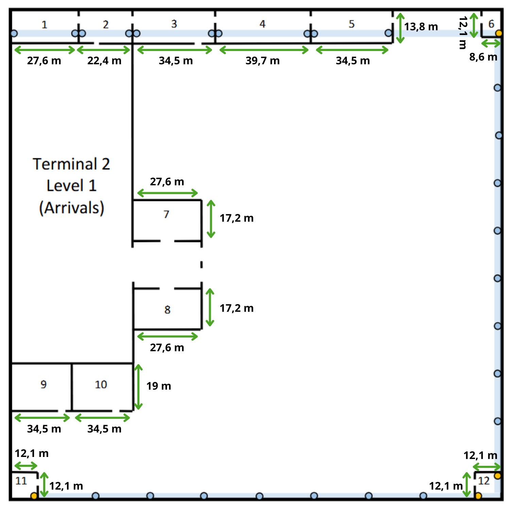

| Sala | Área (m²) | Número de Outlets |
|------|-----------|-------------------|
| 1    | 380,88    | 77                |
| 2    | 309,12    | 62                |
| 3    | 476,10    | 96                |
| 4    | 547,86    | 110               |
| 5    | 476,10    | 96                |
| 6    | 104,06    | 0                 |
| 7    | 474,72    | 95                |
| 8    | 474,72    | 95                |
| 9    | 655,50    | 0                 |
| 10   | 655,50    | 0                 |
| 11   | 146,41    | 0                 |
| 12   | 146,41    | 0                 |

#### Total de Outlets – Level 1 (Salas)
**631 outlets**

### Level 4 - Departures

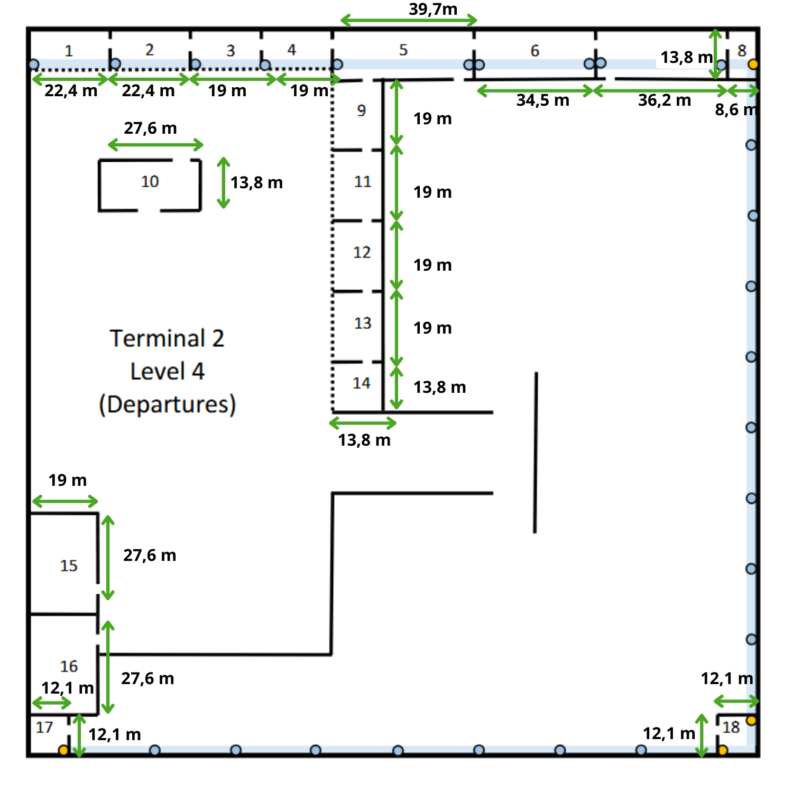

| Sala | Área (m²) | Número de Outlets |
|------|-----------|-------------------|
| 1    | 224,00    | 45                |
| 2    | 224,00    | 45                |
| 3    | 190,00    | 38                |
| 4    | 190,00    | 38                |
| 5    | 547,86    | 110               |
| 6    | 476,10    | 96                |
| 7    | 499,56    | 100               |
| 8    | 118,68    | 0                 |
| 9    | 262,20    | 53                |
| 10   | 380,88    | 77                |
| 11   | 262,20    | 53                |
| 12   | 262,20    | 53                |
| 13   | 262,20    | 53                |
| 14   | 190,44    | 39                |
| 15   | 524,40    | 0                 |
| 16   | 524,40    | 0                 |
| 17   | 146,41    | 0                 |
| 18   | 146,41    | 0                 |

#### Total de Outlets – Level 4 (Salas)
**800 outlets**

---

## 4. Tomadas nas Paredes Exteriores para ambos os pisos
As dimensões reais do piso, após subtrair os comprimentos das salas que já possuem tomadas internas, são:
- **Level 1 – Arrivals:** 177,6 m × 177,6 m
- **Level 4 – Departures:** 175,9 m × 177,6 m

Aplicando a regra de uma tomada a cada 5 metros:

Outlets = $\left\lceil \frac{\text{Comprimento útil da parede}}{5} \right\rceil$
(**Nota**: Tudo arredondado por excesso.)

### Level 1 - Arrivals
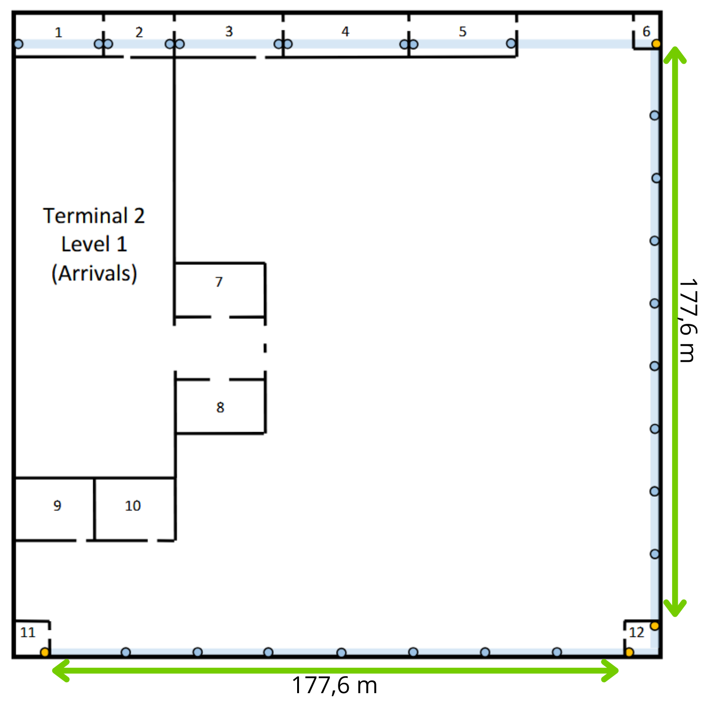
- Parede direita: 36 tomadas
- Parede inferior: 36 tomadas
- Total paredes externas: 72 tomadas

### Level 2 - Departures
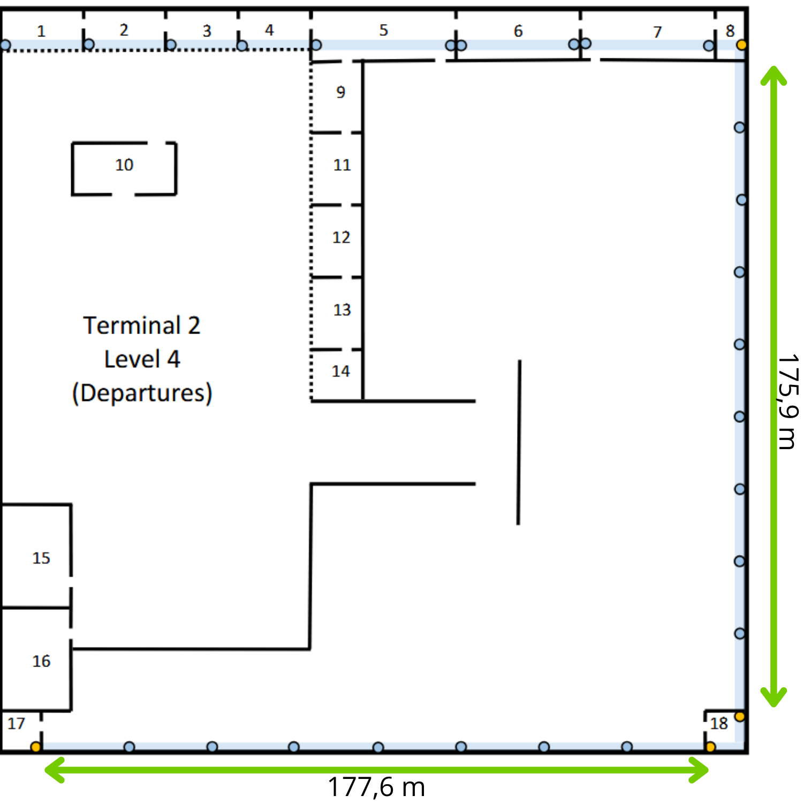
- Parede direita: 36 tomadas
- Parede inferior: 36 tomadas
- Total paredes externas: 72 tomadas

## Posicionamento das tomadas de rede 
### Level 1 - Arrivals
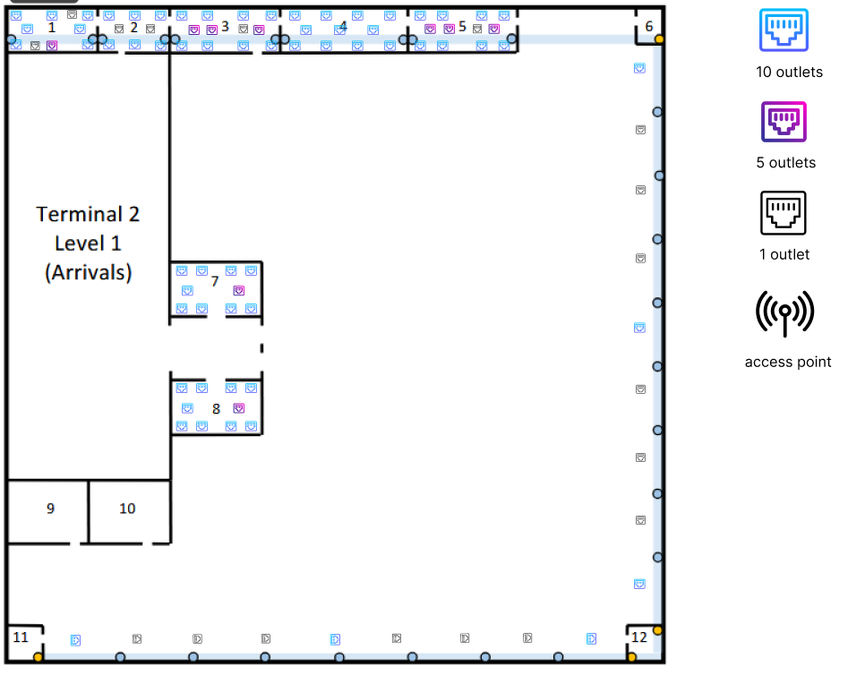

### Level 4 - Departures
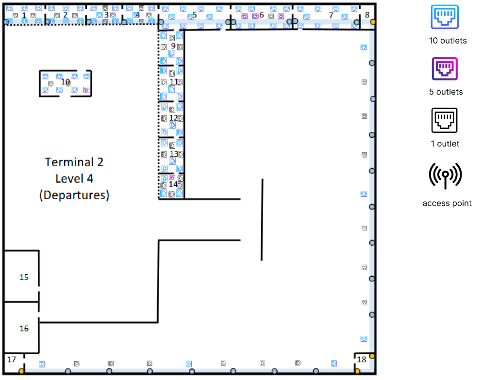

---

## 5. Pontos de Acesso Wireless 

Ambos os pisos do Terminal 2 requerem cobertura de rede sem fios.
Cada Wireless Access Point (WAP) garante uma cobertura circular aproximada com **50 metros de diâmetro (25 metros de raio)**.

### Cálculo da Área de Cobertura

A área de cobertura de cada WAP pode ser estimada através da expressão:
A = πr² (Onde: r = 25 m)

Logo:
A ≈ 3.14 × 25² ≈ 1963 m²

### Número de WAPs Necessários

A área total aproximada de cada piso é:
200 × 200 = 40000 m²

Número mínimo de WAPs:
N = Área do piso / Área de cobertura do WAP
N = 40000 / 1963  
N ≈ **20.38**

Arredondando por excesso:
N ≈ **21 WAPs**

### Ajuste para Condições Reais

O valor anterior corresponde apenas a um cenário **teórico ideal**.
Na prática, diversos fatores reduzem a eficácia da cobertura:

- Atenuação do sinal provocada por **paredes, pilares e estruturas metálicas**
- **Elevada densidade de utilizadores** típica de um terminal aeroportuário
- Necessidade de **sobreposição entre células Wi-Fi** para permitir roaming contínuo

Para compensar estes fatores, foi aplicado um **fator de segurança de aproximadamente 40%**.

Cálculo:
N_real = 21 + (21 × 0.4) <=>
N_real ≈ **29.4**

Arredondando por excesso:
N_real ≈ **30 WAPs por piso**

### Posicionamento no teto falso
A seleção dos canais 1, 6 e 11 para os Access Points foi efetuada de forma intercalada para garantir que células de cobertura vizinhas não utilizem frequências comuns, uma vez que estes são os únicos três canais que não se sobrepõem (non-overlapping) na banda de 2.4 GHz, mitigando assim a interferência e colisões de sinal entre APs adjacentes

#### Level 1 - Arrivals
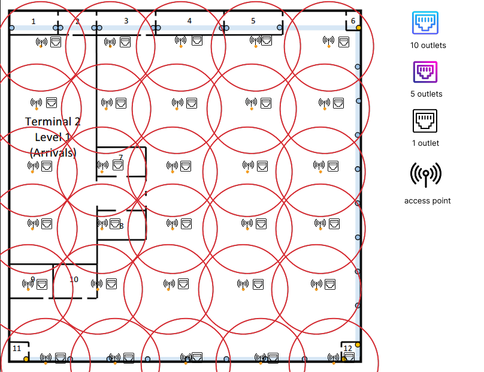

**Nota**: Cada WAP requer uma **tomada de rede RJ45 (ISO 8877)** instalada no **teto falso**, localizado a 4 metros de altura.

#### Level 4 - Departures
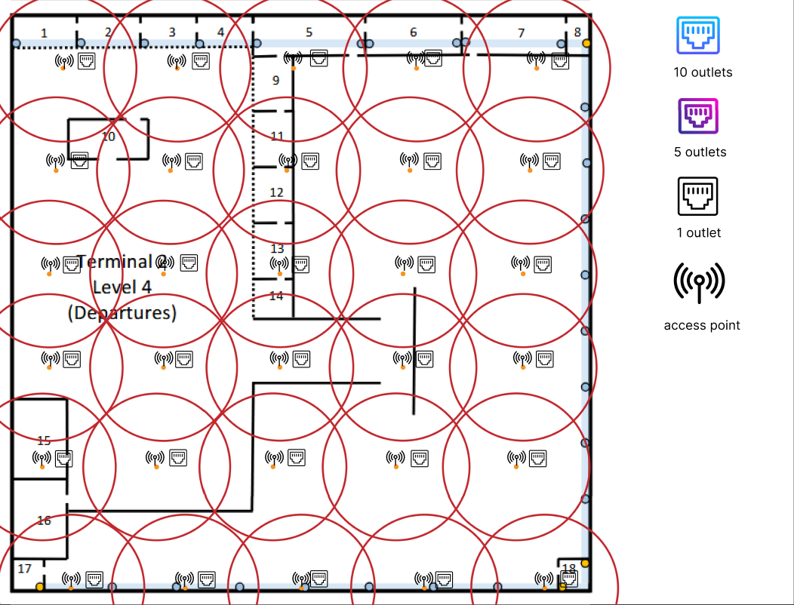

**Nota**: Cada WAP requer uma **tomada de rede RJ45 (ISO 8877)** instalada no **teto falso**, localizado a 4 metros de altura.

---

## 6. Hierarquia e Localização dos Distribuidores 

O projeto de cablagem estruturada segue uma arquitetura hierárquica de três níveis:
MC → IC → HC → CP → Outlets
Esta estrutura permite uma distribuição eficiente da rede, respeitando as limitações técnicas da cablagem horizontal e facilitando a gestão da infraestrutura.

### Level 1 - Arrivals
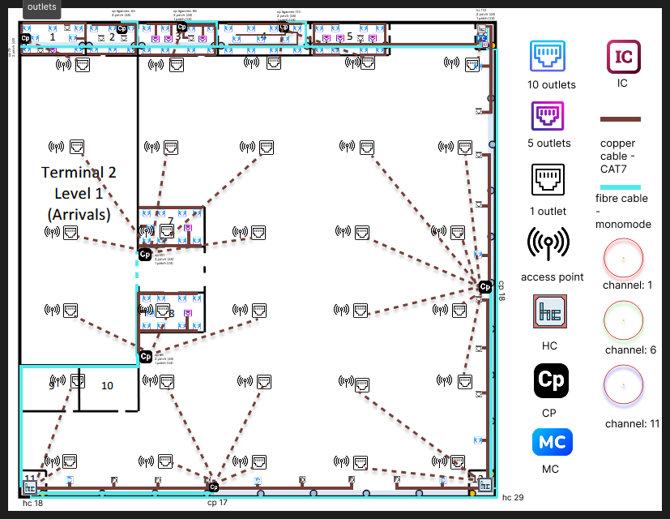

### Sala 6 – Núcleo de Distribuição do Terminal 2

A **Sala 6** foi selecionada como o principal ponto de distribuição do Terminal 2 por possuir **passagens verticais de cabos** (identificadas na planta por pontos amarelos) com ligação direta à **galeria técnica subterrânea do campus**.
Nesta sala encontram-se instalados:

- **Main Cross-Connect (MC)**  
  Ponto principal de interligação com o **backbone do campus**, responsável por ligar o Terminal 2 aos restantes edifícios através da galeria técnica subterrânea.

- **Intermediate Cross-Connect (IC)**  
  Distribuidor central do edifício que recebe a ligação proveniente do MC e distribui a conectividade para todos os restantes distribuidores do Terminal 2.

- **Horizontal Cross-Connect (HC – Sala 6)**  
  Responsável pela ligação direta a **112 tomadas de rede locais**.

### HC – Sala 6

Este HC alimenta **112 tomadas de rede** localizadas nas zonas próximas da Sala 6.
Patch panels utilizados:

| Patch Panel | Portas | Espaço |
|---|---|---|
| Patch Panel | 48 portas | 2U |
| Patch Panel | 48 portas | 2U |
| Patch Panel | 24 portas | 1U |

Total ocupado:
2U + 2U + 1U = 5U

Para alojar o MC, IC, HC, equipamentos ativos e espaço de expansão futura foi selecionado um **rack de 42U**.

---

### Outros Horizontal Cross-Connects (HC)

Além da Sala 6, foram instalados HCs adicionais em locais indicados no enunciado como adequados para alojamento de hardware.

#### HC – Sala 11

- Número de ligações: **18**
- Patch panel utilizado:

| Tipo | Portas | Espaço |
|---|---|---|
| Patch Panel | 24 portas | 1U |

Espaço total ocupado: **1U**

Aplicando a regra de dimensionamento dos racks (4 × S):
S = 1U
Rack ≈ 4U
Foi selecionado um **rack de 6U**, permitindo espaço adicional para equipamentos ativos e expansões futuras.

---

#### HC – Sala 12

- Número de ligações: **29**

| Tipo | Portas | Espaço |
|---|---|---|
| Patch Panel | 48 portas | 2U |

Espaço total ocupado: **2U**

Aplicando a regra de dimensionamento:
S = 2U
Rack ≈ 8U
Foi selecionado um **rack de 12U**, garantindo espaço para equipamentos ativos e futuras expansões.

---

## Estratégia de Consolidation Points (CPs)

Devido às dimensões do piso (**aproximadamente 200 m × 200 m**) e à limitação de **90 metros de cabo horizontal em cobre**, foram implementados **Consolidation Points (CPs)** distribuídos pelo piso.

Os CPs permitem:
- reduzir o número de cabos diretos ligados aos HCs
- manter todas as distâncias dentro dos limites da cablagem estruturada
- distribuir melhor a densidade de tomadas
- simplificar futuras reconfigurações da rede

---

### Zona Superior (Salas 1, 2 e 3)

Esta zona apresenta elevada densidade de tomadas.

Foram instalados **três CPs**:

| Sala | Número de Outlets |
|---|---|
| Sala 1 | 79 |
| Sala 2 | 63 |
| Sala 3 | 98 |

Os CPs garantem que todas as tomadas localizadas nas extremidades das salas permanecem dentro do limite máximo de distância.

### CP – Sala 1

Este CP serve **79 ligações** provenientes das tomadas localizadas na Sala 1 e áreas próximas.

Patch panels utilizados:

| Patch Panel | Portas | Espaço |
|---|---|---|
| Patch Panel | 48 portas | 2U |
| Patch Panel | 48 portas | 2U |

Espaço total ocupado: 4U
Foi selecionado um **rack de 22U / 24U**, permitindo espaço para equipamentos ativos e futuras expansões.

### CP – Sala 2

Este CP serve **63 ligações**.

Patch panels utilizados:

| Patch Panel | Portas | Espaço |
|---|---|---|
| Patch Panel | 48 portas | 2U |
| Patch Panel | 48 portas | 2U |

Espaço ocupado: 4U
Foi selecionado um **rack de 22U / 24U**, garantindo espaço para equipamentos ativos e futuras expansões.

### CP – Sala 3

Este CP serve **98 ligações**.

Patch panels utilizados:

| Patch Panel | Portas | Espaço |
|---|---|---|
| Patch Panel | 48 portas | 2U |
| Patch Panel | 48 portas | 2U |
| Patch Panel | 24 portas | 1U |

Espaço total ocupado: 5U
Foi selecionado um **rack de 24U**, garantindo espaço para equipamentos ativos e futuras expansões.

---

### Zona Inferior (Salas 7 e 8)

Foram instalados **dois CPs externos** responsáveis pela distribuição da rede nesta área.

| Zona | Ligações |
|---|---|
| CP – Sala 7 | 101 |
| CP – Sala 8 | 98 |

### CP – Zona Inferior (Exterior da Sala 7)

Este CP distribui ligações para a **Sala 7 e tomadas exteriores próximas**.

Número de ligações: **101**

Patch panels utilizados:

| Patch Panel | Portas | Espaço |
|---|---|---|
| Patch Panel | 48 portas | 2U |
| Patch Panel | 48 portas | 2U |
| Patch Panel | 24 portas | 1U |

Espaço ocupado: 5U
Foi selecionado um **rack de 24U**, garantindo espaço para equipamentos ativos e futuras expansões.

### CP – Zona Inferior (Exterior da Sala 8)

Este CP distribui ligações para a **Sala 8 e tomadas próximas**.

Número de ligações: **98**

Patch panels utilizados:

| Patch Panel | Portas | Espaço |
|---|---|---|
| Patch Panel | 48 portas | 2U |
| Patch Panel | 48 portas | 2U |
| Patch Panel | 24 portas | 1U |

Espaço ocupado: 5U
Foi selecionado um **rack de 24U**, garantindo espaço para equipamentos ativos e futuras expansões.

---

### Paredes Externas

Ao longo das paredes externas foram instaladas tomadas a cada **5 metros**, conforme definido nos requisitos do projeto. 
(Embora no esquema não estejam representadas as tomadas precisamente de 5 em 5 metros, todos os calculos de distância foram realizados considerando esta regra.)

Para gerir estas ligações foram criados **dois CPs de baixa densidade**:

| Localização | Ligações |
|---|---|
| Parede direita | 18 |
| Parede inferior | 17 |

### CP – Parede Direita

Foi instalado um CP aproximadamente a meio da parede direita do piso para servir as tomadas instaladas ao longo dessa parede.

Número de ligações: **18**

Patch panel utilizado:

| Patch Panel | Portas | Espaço |
|---|---|---|
| Patch Panel | 24 portas | 1U |

Rack selecionado: **6U**

### CP – Parede Inferior

Outro CP foi instalado aproximadamente a meio da parede inferior do piso.

Número de ligações: **17**

Patch panel utilizado:

| Patch Panel | Portas | Espaço |
|---|---|---|
| Patch Panel | 24 portas | 1U |

Rack selecionado: **6U**

### Level 4 - Departures
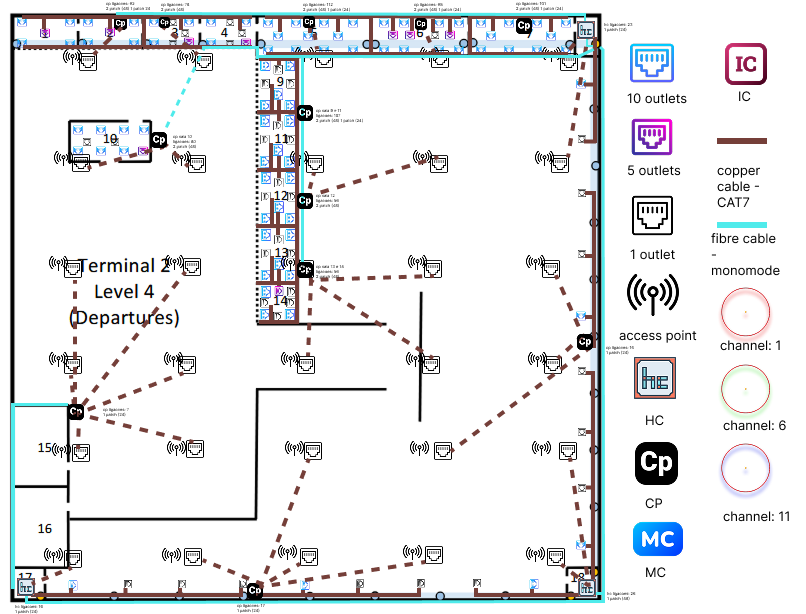

### Sala 8 – Distribuição Principal do Piso

A **Sala 8** foi selecionada como o principal ponto de distribuição deste piso por possuir **passagens verticais de cabos** (identificadas na planta por pontos amarelos), permitindo a ligação direta ao **Intermediate Cross-Connect (IC)** localizado no piso técnico.

Nesta sala encontra-se instalado um **Horizontal Cross-Connect (HC)** responsável por alimentar grande parte dos Consolidation Points (CPs) do piso.

### HC – Sala 8

Este HC alimenta **23 tomadas de rede locais** e serve também como ponto de distribuição para vários **CPs distribuídos pelo piso**.

Patch panel utilizado:

| Patch Panel | Portas | Espaço |
|---|---|---|
| Patch Panel | 24 portas | 1U |

Espaço total ocupado: **1U**

Aplicando a regra de dimensionamento (4 × S):

S = 1U  
Rack ≈ 4U

Foi selecionado um **rack de 6U**, permitindo espaço adicional para equipamentos ativos e futuras expansões.

---

### Outros Horizontal Cross-Connects (HC)

Além da Sala 8, foram instalados dois HCs adicionais para alimentar zonas mais afastadas do piso.

#### HC – Sala 18

- Número de ligações: **26**

Patch panel utilizado:

| Patch Panel | Portas | Espaço |
|---|---|---|
| Patch Panel | 48 portas | 2U |

Espaço total ocupado: **2U**

Aplicando a regra de dimensionamento:

S = 2U  
Rack ≈ 8U

Foi selecionado um **rack de 12U**, garantindo espaço para equipamentos ativos e futuras expansões.

---

#### HC – Sala 17

- Número de ligações: **16**

Patch panel utilizado:

| Patch Panel | Portas | Espaço |
|---|---|---|
| Patch Panel | 24 portas | 1U |

Espaço total ocupado: **1U**

Aplicando a regra de dimensionamento:

S = 1U  
Rack ≈ 4U

Foi selecionado um **rack de 6U**, permitindo espaço adicional para equipamentos ativos e expansões futuras.

---

## Estratégia de Consolidation Points (CPs)

Devido à dimensão do piso e à necessidade de respeitar o limite máximo de **90 metros para cabos horizontais em cobre**, foram implementados vários **Consolidation Points (CPs)** distribuídos estrategicamente pelo piso.

Os CPs permitem:

- reduzir o número de cabos diretamente ligados aos HCs
- manter todas as distâncias dentro dos limites da cablagem estruturada
- distribuir melhor a densidade de tomadas
- simplificar futuras reconfigurações da rede

---

### Zona Central (Salas 5, 6 e 7)

Foram instalados três CPs responsáveis pela distribuição das ligações nestas salas.

| Localização | Ligações |
|---|---|
| CP – Sala 7 | 101 |
| CP – Sala 6 | 98 |
| CP – Sala 5 | 112 |

### CP – Sala 7

Este CP serve **101 ligações**.

Patch panels utilizados:

| Patch Panel | Portas | Espaço |
|---|---|---|
| Patch Panel | 48 portas | 2U |
| Patch Panel | 48 portas | 2U |
| Patch Panel | 24 portas | 1U |

Espaço total ocupado: **5U**

Foi selecionado um **rack de 24U**, garantindo espaço para equipamentos ativos e futuras expansões.

---

### CP – Sala 6

Este CP serve **98 ligações**.

Patch panels utilizados:

| Patch Panel | Portas | Espaço |
|---|---|---|
| Patch Panel | 48 portas | 2U |
| Patch Panel | 48 portas | 2U |
| Patch Panel | 24 portas | 1U |

Espaço total ocupado: **5U**

Foi selecionado um **rack de 24U**.

---

### CP – Sala 5

Este CP serve **112 ligações**.

Patch panels utilizados:

| Patch Panel | Portas | Espaço |
|---|---|---|
| Patch Panel | 48 portas | 2U |
| Patch Panel | 48 portas | 2U |
| Patch Panel | 24 portas | 1U |

Espaço total ocupado: **5U**

Foi selecionado um **rack de 24U**.

---

### Zona Superior (Salas 1, 2, 3 e 4)

Nesta área foram instalados dois CPs responsáveis pela distribuição das tomadas.

| Localização | Ligações |
|---|---|
| CP – Sala 3 (salas 3 e 4) | 78 |
| CP – Sala 2 (salas 1 e 2) | 92 |

### CP – Sala 3

Este CP serve **78 ligações** distribuídas pelas salas **3 e 4**.

Patch panels utilizados:

| Patch Panel | Portas | Espaço |
|---|---|---|
| Patch Panel | 48 portas | 2U |
| Patch Panel | 48 portas | 2U |

Espaço ocupado: **4U**

Foi selecionado um **rack de 22U / 24U**.

---

### CP – Sala 2

Este CP serve **92 ligações** distribuídas pelas salas **1 e 2**.

Patch panels utilizados:

| Patch Panel | Portas | Espaço |
|---|---|---|
| Patch Panel | 48 portas | 2U |
| Patch Panel | 48 portas | 2U |
| Patch Panel | 24 portas | 1U |

Espaço ocupado: **5U**

Foi selecionado um **rack de 24U**.

---

### Zona Exterior do Piso

Foram instalados vários CPs ao longo das áreas exteriores do piso para alimentar tomadas instaladas nas paredes e zonas abertas.

| Localização | Ligações |
|---|---|
| Exterior Sala 10 | 80 |
| Exterior entre Salas 9 e 11 | 107 |
| Exterior Sala 12 | 56 |
| Exterior entre Salas 13 e 14 | 56 |

### CP – Exterior Sala 10

Número de ligações: **80**

Patch panels utilizados:

| Patch Panel | Portas | Espaço |
|---|---|---|
| Patch Panel | 48 portas | 2U |
| Patch Panel | 48 portas | 2U |

Espaço ocupado: **4U**

Rack selecionado: **22U / 24U**

---

### CP – Exterior entre Salas 9 e 11

Número de ligações: **107**

Patch panels utilizados:

| Patch Panel | Portas | Espaço |
|---|---|---|
| Patch Panel | 48 portas | 2U |
| Patch Panel | 48 portas | 2U |
| Patch Panel | 24 portas | 1U |

Espaço ocupado: **5U**

Rack selecionado: **24U**

---

### CP – Exterior Sala 12

Número de ligações: **56**

Patch panels utilizados:

| Patch Panel | Portas | Espaço |
|---|---|---|
| Patch Panel | 48 portas | 2U |
| Patch Panel | 48 portas | 2U |

Espaço ocupado: **4U**

Rack selecionado: **22U / 24U**

---

### CP – Exterior entre Salas 13 e 14

Número de ligações: **56**

Patch panels utilizados:

| Patch Panel | Portas | Espaço |
|---|---|---|
| Patch Panel | 48 portas | 2U |
| Patch Panel | 48 portas | 2U |

Espaço ocupado: **4U**

Rack selecionado: **22U / 24U**

---

### CPs Adicionais de Distribuição

Alguns CPs adicionais foram instalados para garantir cobertura em zonas periféricas e alimentar pontos de acesso sem fios.

| Localização | Ligações |
|---|---|
| Parede direita do piso | 16 |
| Parede inferior do piso | 17 |
| Exterior Sala 15 | 7 |

### CP – Parede Direita

Número de ligações: **16**

Patch panel utilizado:

| Patch Panel | Portas | Espaço |
|---|---|---|
| Patch Panel | 24 portas | 1U |

Rack selecionado: **6U**

---

### CP – Parede Inferior

Número de ligações: **17**

Patch panel utilizado:

| Patch Panel | Portas | Espaço |
|---|---|---|
| Patch Panel | 24 portas | 1U |

Rack selecionado: **6U**

---

### CP – Exterior Sala 15

Este CP foi instalado para alimentar **Wireless Access Points (APs)** numa zona onde não existia um ponto de distribuição próximo.

Número de ligações: **7**

Patch panel utilizado:

| Patch Panel | Portas | Espaço |
|---|---|---|
| Patch Panel | 24 portas | 1U |

Rack selecionado: **6U**

---

## 7. Dimensionamento dos Telecommunications Enclosures (Racks)

Para dimensionar os armários de telecomunicações foi aplicada a regra:
Tamanho do Rack = 4 × S

Onde **S** representa o espaço ocupado pelos patch panels.

Esta abordagem garante:
- espaço suficiente para **equipamentos ativos**
- espaço para **gestão de cabos**
- **reserva de capacidade futura (~100%)**

---

**Nota:**  
Alguns racks apresentam **unidades livres (U) não ocupadas**, destinadas a:
- futuras expansões da rede
- instalação de novos patch panels
- adição de switches ou outros equipamentos ativos

---

## 8. Legenda e Caminhos de Cabos

Para facilitar a leitura dos diagramas de rede foram utilizadas duas representações distintas.

### Linha Contínua

Representa cablagem instalada:
- nas **calhas técnicas sob o piso**
- embutida nas **paredes**

Utilizada para ligar:
HC / CP → Network Outlets

---

### Linha Tracejada

Representa cablagem que percorre o **teto falso**, localizado a **4 metros de altura**.

Utilizada principalmente para alimentar:
- **As outlets dos Wireless Access Points (APs)**

---

## Nota Técnica

Todas as ligações entre o **Intermediate Cross-Connect (IC)** localizado na **Sala 6** e os restantes **HCs e CPs remotos** são realizadas através de **fibra ótica monomodo**, constituindo o **backbone interno do edifício**.
A distribuição final até às tomadas de utilizador é efetuada utilizando **cabos de cobre CAT7**, respeitando os limites de distância definidos pelas normas de cablagem estruturada.

---
### 9. Backbone do campus
A ligação entre o **Main Cross-Connect (MC)** do Terminal 2 e o **backbone do campus** é realizada através de um cabo de fibra ótica monomodo, instalado na galeria técnica subterrânea que liga o edifício aos restantes pontos de distribuição do campus.

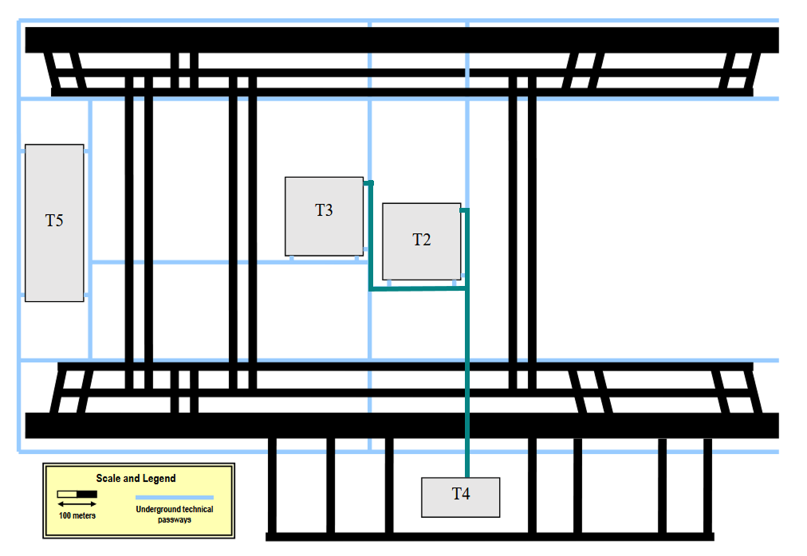

Total de cabo de fibra ótica necessário para o backbone do campus: 688 (T2-T4) + 760 (T2-T3) = **1 448 metros**.

---
### 10. Inventário Técnico
O total de cabos necessários para a infraestrutura **horizontal e backbone**, inclui as margens adicionais consideradas para:
- **passagens verticais:** 10 m
- **passagem pelo teto falso:** 4 m
- 
### Level 1 - Arrivals

### Cablagem (Meios de Transmissão)

| Item | Especificação | Quantidade Total | Observações |
|---|---|---|---|
| Cabo de Cobre | CAT7 S/STP | **18 127,36 metros** | Soma de todos os troços horizontais calculados |
| Cabo de Fibra Ótica | Monomode (8 fibras) | **1 862,20 metros** | Soma das ligações MC → IC → HC e HC → CP |

### Level 4 – Departures

| Item | Especificação | Quantidade Total | Justificação Técnica |
|---|---|---|---|
| Cabo de Cobre | CAT7 S/STP | **20 445,54 metros** | Soma de todos os troços horizontais para as 902 tomadas |
| Cabo de Fibra Ótica | Monomode (8 fibras) | **1 818,45 metros** | Soma das ligações IC → HC e HC → CP |

---

## Conetividade e Terminação (Outlets e Conetores)

Cálculo baseado no número total de tomadas de rede e nas terminações necessárias para as ligações de fibra ótica.

### Level 1 - Arrivals

| Item | Especificação | Quantidade         | Justificação                                                                       |
|---|---|--------------------|------------------------------------------------------------------------------------|
| Tomadas de Rede | ISO 8877 (RJ45) CAT7 | **733 unidades**   | 631 (salas) + 30 (WAPs) + 72 (paredes externas)                                    |
| Conetores de Fibra | LC ou SC (Polimento UPC) | **192 unidades**   | Mínimo de 8 fibras por link de backbone e 2 extremidades (12 links × 16 conetores) |
| Patch Cords (Cobre) | CAT7 (0.5 m e 3 m) | **1 482 unidades** | 2 por cada outlet (uma no rack e outra no utilizador)                              |
| Patch Cords (Fibra) | Monomode Duplex | **20 unidades**    | 2 por cada link de backbone ativo                                                  |

### Level 4 - Departures

| Item | Especificação | Quantidade | Observações |
|---|---|---|---|
| Tomadas de Rede | ISO 8877 (RJ45) CAT7 | **902 unidades** | 800 (salas) + 30 (WAPs) + 72 (paredes externas) |
| Conetores de Fibra | LC ou SC (UPC) | **224 unidades** | 14 links (3 IC-HC + 11 HC-CP) × 16 conetores |
| Patch Cords (Cobre) | CAT7 (0.5 m e 3 m) | **1 804 unidades** | 2 por cada outlet |
| Patch Cords (Fibra) | Monomode Duplex | **28 unidades** | 2 por cada link de backbone ativo |

---

## Painéis de Distribuição (Patch Panels)

### Level 1 – Arrivals

| Equipamento | Capacidade | Quantidade | Total de Portas |
|---|---|---|---|
| Patch Panel Cobre | 48 portas (2U) | 11 | 528 |
| Patch Panel Cobre | 24 portas (1U) | 6 | 144 |

### Level 4 – Departures

| Equipamento | Capacidade | Quantidade | Total de Portas |
|---|---|---|---|
| Patch Panel Cobre | 48 portas (2U) | 18 | 864 |
| Patch Panel Cobre | 24 portas (1U) | 11 | 264 |

---

## Dimensionamento dos Armários (Racks de 19")

Para dimensionar os armários de telecomunicações foi aplicada a regra:
**Tamanho do Rack = 4 × S**
Onde **S** corresponde ao espaço ocupado pelos **patch panels**.

Esta abordagem garante:
- espaço para **equipamentos ativos (switches)**
- espaço para **gestão de cabos**
- **capacidade de expansão futura (~100%)**

### Level 1 – Arrivals

| Localização | Espaço Painéis (S) | Cálculo (4 × S) | Rack Selecionado |
|---|---|---|---|
| Sala 6 (MC / IC / HC) | 5U (HC) + backbone | - | **42U** |
| Sala 11 (HC) | 1U (1×24 portas) | 4U | **6U** |
| Sala 12 (HC) | 2U (1×48 portas) | 8U | **12U** |
| CPs Alta Densidade | 4U a 6U | 16U a 24U | **24U** (Salas 1, 3, 4, 7, 8) |
| CPs Parede / Baixa Densidade | 1U | 4U | **6U** |

### Level 4 – Departures

| Localização | Espaço Painéis (S) | Cálculo (4 × S) | Rack Sugerido |
|---|---|---|---|
| Sala 8 (HC / ligação ao IC) | Alta densidade | - | **42U** |
| Salas 17 e 18 (HC) | 1U a 2U | 4U a 8U | **12U** |
| CPs Alta Densidade | 4U a 5U | 16U a 20U | **24U** |
| CPs Baixa Densidade | 1U a 2U | 4U a 8U | **12U** |

---

# 11- Resumo Global da Infraestrutura (Level 1 + Level 4)

| Elemento          | Level 1     | Level 4     | Total           |
|-------------------|-------------|-------------|-----------------|
| Tomadas de Rede   | 733         | 902         | **1 635**       |
| Cabo CAT7         | 18 127,36 m | 20 445,54 m | **38 572,90 m** |
| Fibra Ótica       | 1 862,20 m  | 1 818,45 m  | **3 680,65 m**  |
| Patch Panels      | 17          | 29          | **46**          |
| Patch Cords Cobre | 1 482       | 1 804       | **3 286**       |
| Patch Cords Fibra | 20          | 28          | **48**          |
| Conetores Fibra   | 160         | 224         | **384**         |
| WAPS              | 30          | 30          | **60**          |
| CPS               | 8           | 12          | **20**          |
| MC                | 1           | 0           | **1**           |
| IC                | 1           | 0           | **1**           |
| HCS               | 3           | 3           | **6**           |

Este resumo apresenta a dimensão total da infraestrutura de rede implementada no **Terminal 2**, considerando os pisos **Level 1 (Arrivals)** e **Level 4 (Departures)**.