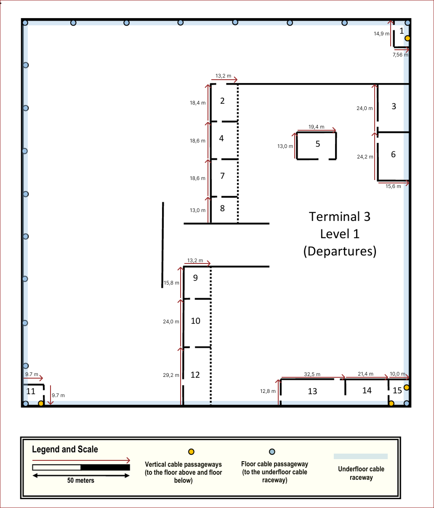
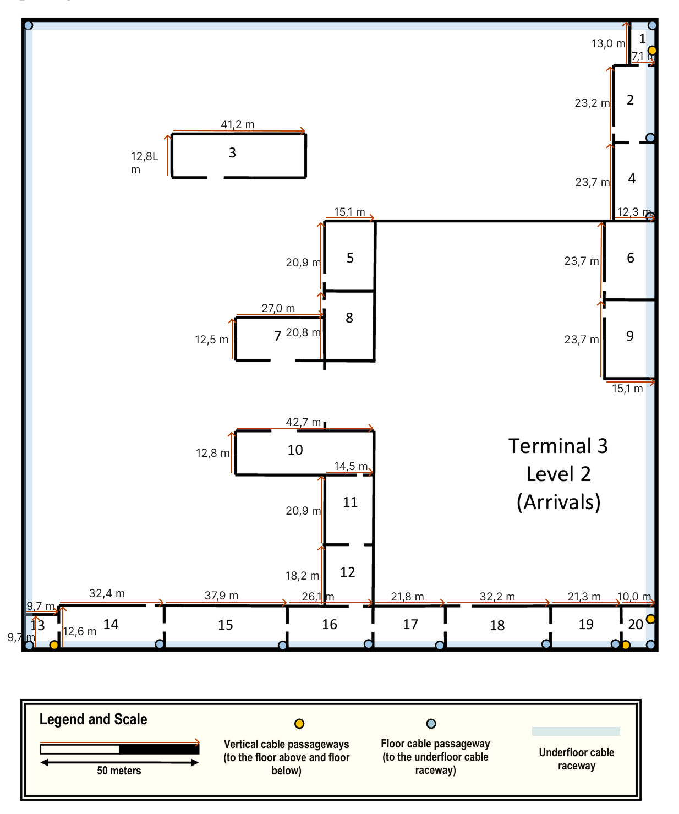
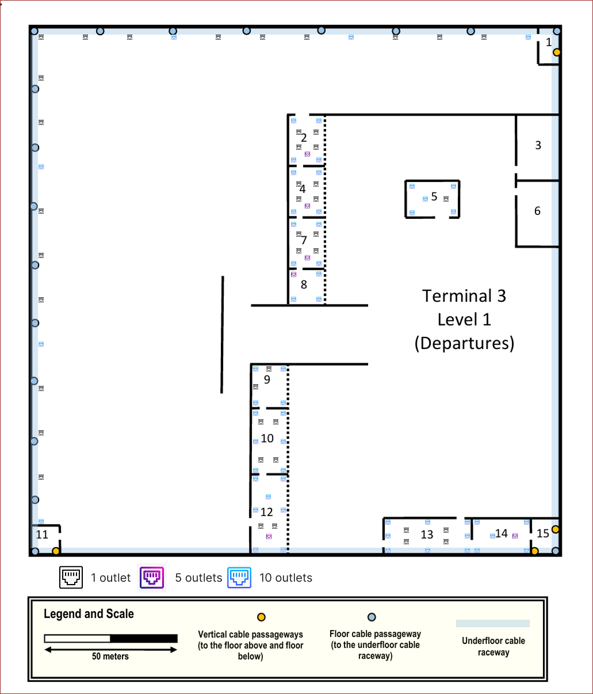
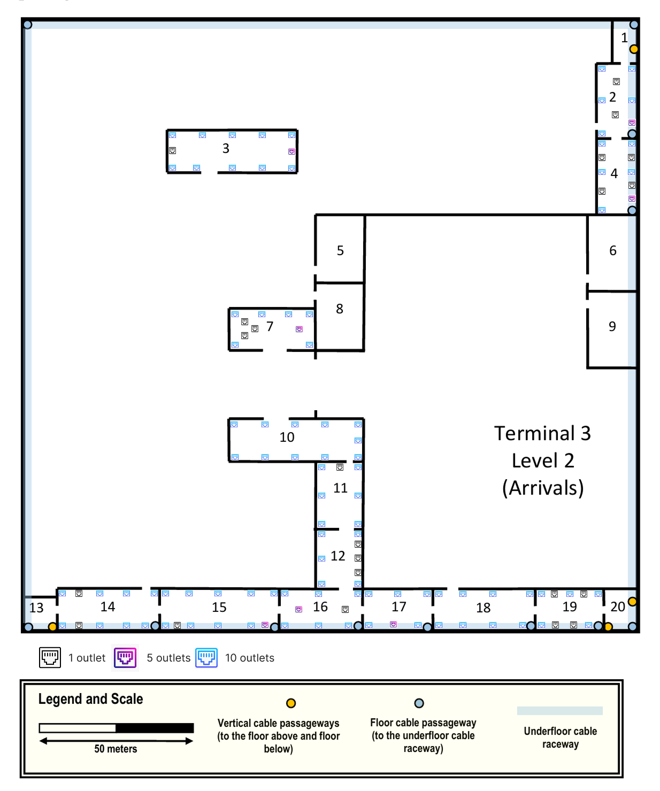
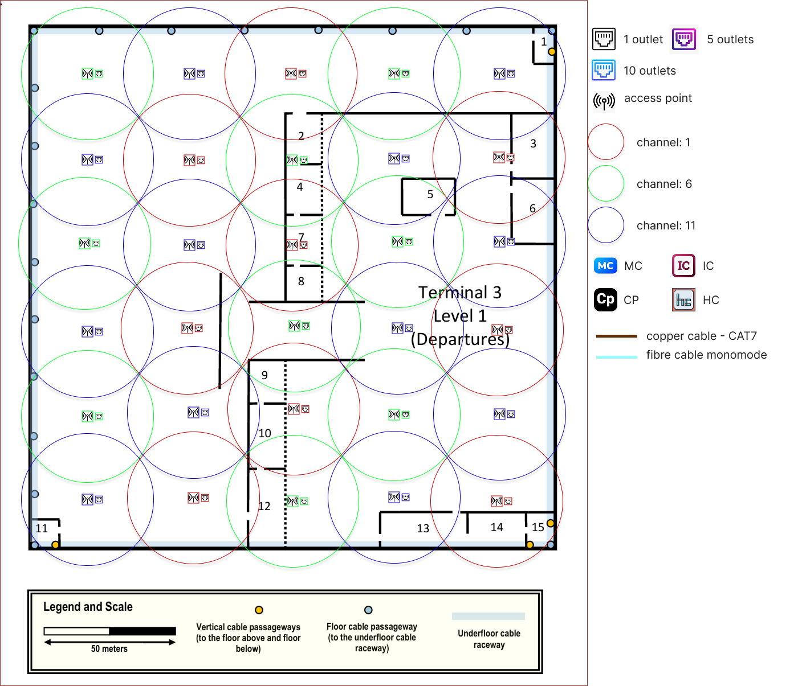
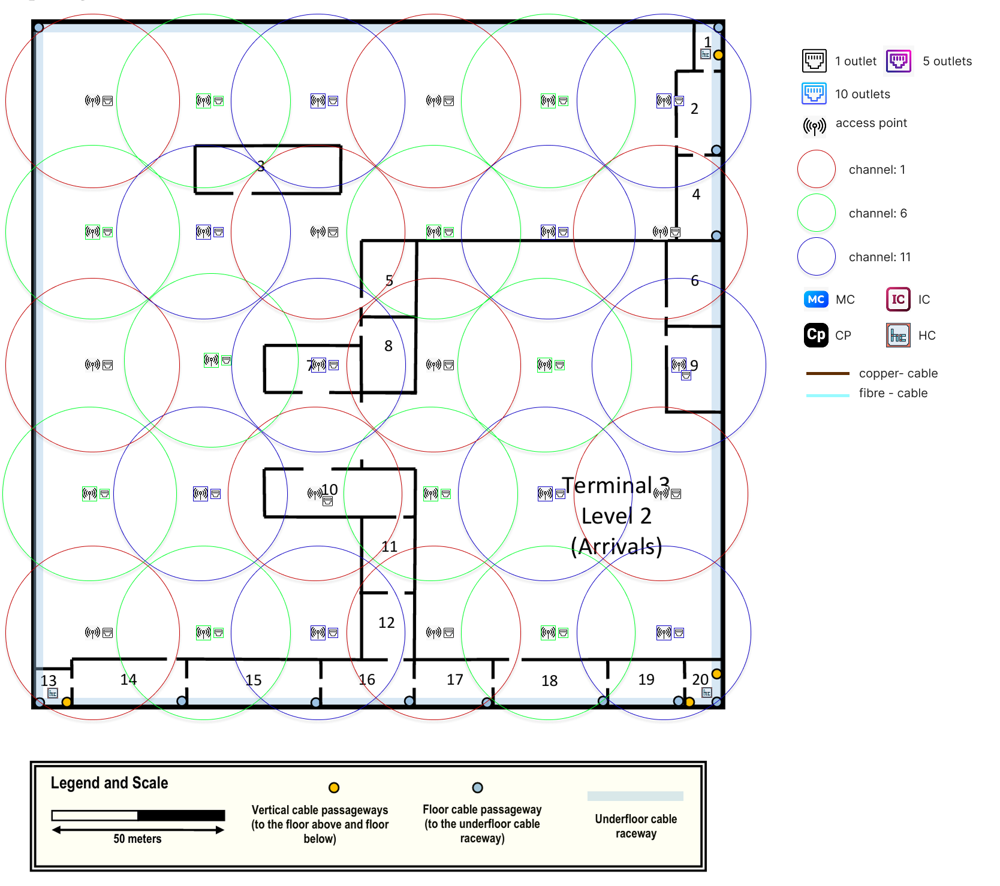
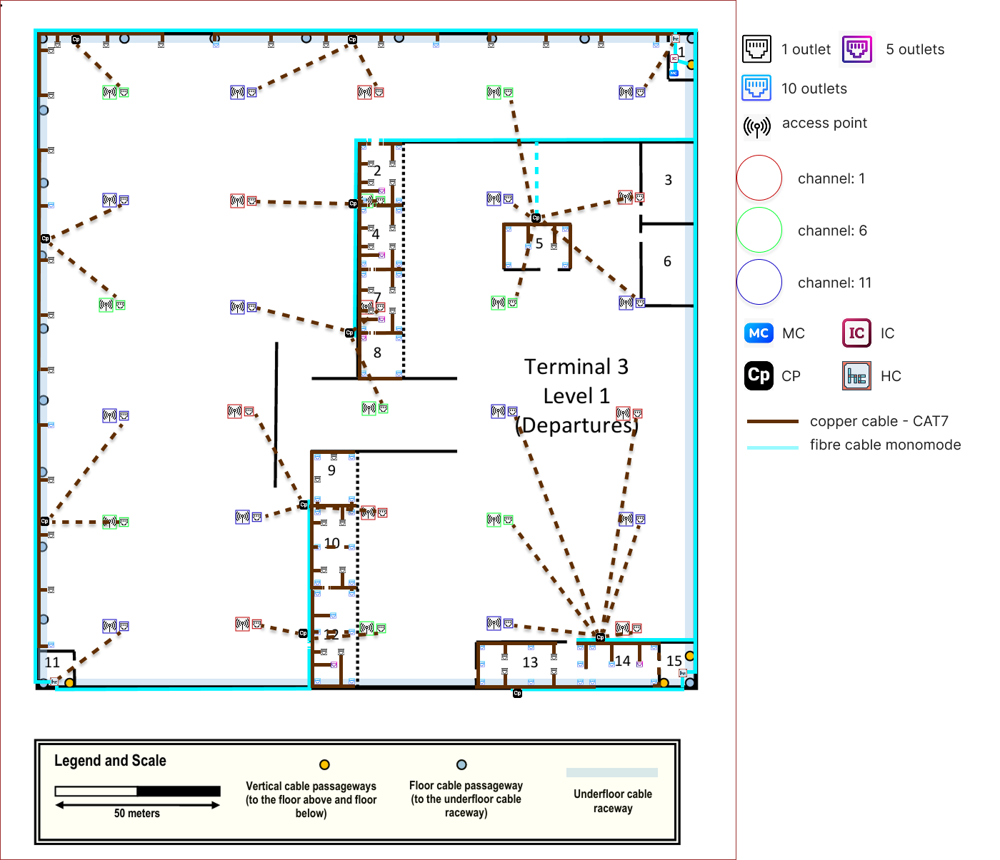
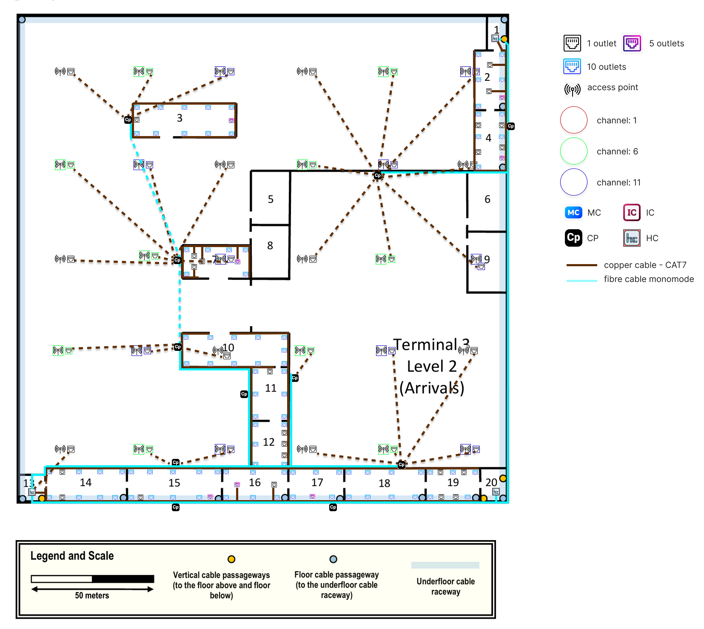

Sprint 1 - Terminal 3 - 1241138
===========================================
---

## Informações Gerais

O edifício do **Terminal 3** é composto por cinco pisos; no entanto, o presente projeto abrange apenas o **Piso 1 (Partidas)** e o **Piso 2 (Chegadas)**.

Ambos os pisos deverão garantir cobertura de rede local sem fios (**Wireless LAN – Wi-Fi**).

---

## 1. Requisitos Técnicos

### Level 1 - Departures
- Este piso dispõe de um canal técnico subterrâneo para cablagem, com pontos de acesso devidamente assinalados na planta.
- Existem quatro condutas verticais de cabos que percorrem todos os pisos do edifício. Num piso inferior, estas condutas verticais estabelecem ligação direta à passagem subterrânea exterior.
- A distância vertical entre este piso e o ponto de ligação à passagem subterrânea exterior é de **10 metros**.
- O teto do piso encontra-se a **5 metros do chão**, no entanto, existe um **teto falso a 4 metros**. O espaço técnico acima do teto falso é adequado para instalação de equipamentos de rede.

#### Tomadas de Rede
- As salas **2, 4, 5, 7, 8, 9, 10, 12, 13 e 14** deverão possuir o número padrão de tomadas de rede.
- As salas **1, 3, 6, 11 e 15** não necessitam de tomadas de rede.
- As salas **1, 11 e 15** são adequadas para a instalação de equipamentos de infraestrutura de rede.

#### Tomadas ao Longo das Paredes Exteriores
Ao longo:
- da parede exterior do lado esquerdo da planta;
- da parede exterior na parte superior da planta;

**Nota**: deverá ser instalada **uma tomada de rede (ISO 8877) a cada 5 metros**.


### Level 2 - Arrivals
- Tal como no Piso 1, existe um canal técnico subterrâneo para cablagem, com pontos de acesso assinalados na planta.
- Existem quatro condutas verticais de cabos que percorrem todos os pisos do edifício. Num piso inferior, estas condutas verticais estabelecem ligação direta à passagem subterrânea exterior.
- A distância vertical entre este piso e o ponto de ligação à passagem subterrânea exterior é de **16 metros**.
- O teto do piso encontra-se a **5 metros do chão**, existe um **teto falso a 4 metros**. O espaço técnico acima do teto falso é adequado para instalação de equipamentos de rede.

#### Tomadas de Rede
- As salas **2, 3, 4, 7, 10, 11, 12, 14, 15, 16, 17, 18 e 19** deverão possuir o número padrão de tomadas de rede.
- As salas **1, 5, 6, 8, 9, 13 e 20** não necessitam de tomadas de rede.
- As salas **1, 13 e 20** são adequadas para a instalação de equipamentos de infraestrutura de rede.

**Nota:** O enunciado não define tomadas ao longo das paredes exteriores para o Level 2, pelo que não foram previstas tomadas adicionais em paredes externas neste piso.

---

## 2. Dimensionamento das Tomadas de Rede

O número de tomadas foi calculado de acordo com as normas de cablagem estruturada, considerando **2 tomadas por cada 10 m²**, arredondando sempre por excesso. Este critério foi adotado como decisão de grupo e aplicado de forma consistente a todas as salas de ambos os pisos.

$$\text{Outlets} = \left\lceil \frac{\text{Área (m²)}}{10} \times 2 \right\rceil = \left\lceil \frac{\text{Área (m²)}}{5} \right\rceil$$

**Nota sobre representação gráfica:** Para simplificar a leitura das plantas, as tomadas foram representadas por blocos agregados de 10, 5 e 1 outlet, mantendo-se o número total calculado para cada sala. O número exato de tomadas por sala encontra-se nas tabelas abaixo.

---

## 3. Medidas das Salas

### Level 1 - Departures



- O edifício tem aproximadamente 200 m x 200 m.
- Escala: **231 px = 50 m** → 1 px ≈ 0,216 m

| Sala | Dimensões (m)  | Área (m²) | Número de Outlets  |
|------|----------------|-----------|--------------------|
| 1    | 7,56 × 14,9    | 112,64    | 0                  |
| 2    | 13,2 × 18,4    | 242,88    | 49                 |
| 3    | 15,6 × 24,0    | 374,40    | 0                  |
| 4    | 13,2 × 18,6    | 245,52    | **50**             |
| 5    | 19,4 × 13,0    | 252,20    | 51                 |
| 6    | 15,6 × 24,2    | 377,52    | 0                  |
| 7    | 13,2 × 18,6    | 245,52    | **50**             |
| 8    | 13,2 × 13,0    | 171,60    | 35                 |
| 9    | 13,2 × 15,8    | 208,56    | 42                 |
| 10   | 13,2 × 24,0    | 316,80    | 64                 |
| 11   | 9,7 × 9,7      | 94,09     | 0                  |
| 12   | 13,2 × 29,2    | 385,44    | **78**             |
| 13   | 32,5 × 12,8    | 416,00    | 84                 |
| 14   | 21,4 × 12,8    | 273,92    | 55                 |
| 15   | 10,0 × 12,8    | 128,00    | 0                  |

> **Correções aplicadas:** Salas 4 e 7 corrigidas de 49 para 50 (245,52/5 = 49,104 → ⌈49,104⌉ = 50); Sala 12 corrigida de 77 para 78 (385,44/5 = 77,088 → ⌈77,088⌉ = 78).

#### Total de Outlets – Level 1 (Salas)
**558 tomadas**


### Level 2 - Arrivals



- O edifício tem aproximadamente 200 m x 200 m.
- Escala: **289 px = 50 m** → 1 px ≈ 0,173 m

| Sala | Dimensões (m)  | Área (m²) | Número de Outlets  |
|------|----------------|-----------|--------------------|
| 1    | 7,1 × 13,0     | 92,30     | 0                  |
| 2    | 12,3 × 23,2    | 285,36    | 57                 |
| 3    | 41,2 × 12,8    | 527,36    | 106                |
| 4    | 12,3 × 23,7    | 291,51    | 59                 |
| 5    | 15,1 × 20,9    | 315,59    | 0                  |
| 6    | 15,1 × 23,7    | 357,87    | 0                  |
| 7    | 27,0 × 12,5    | 337,50    | 68                 |
| 8    | 15,1 × 20,8    | 314,08    | 0                  |
| 9    | 15,1 × 23,7    | 357,87    | 0                  |
| 10   | 42,7 × 12,8    | 546,56    | 110                |
| 11   | 14,5 × 20,9    | 303,05    | 61                 |
| 12   | 14,5 × 18,2    | 263,90    | 53                 |
| 13   | 9,7 × 9,7      | 94,09     | 0                  |
| 14   | 32,4 × 12,6    | 408,24    | 82                 |
| 15   | 37,9 × 12,6    | 477,54    | 96                 |
| 16   | 26,1 × 12,6    | 328,86    | 66                 |
| 17   | 21,8 × 12,6    | 274,68    | 55                 |
| 18   | 32,2 × 12,6    | 405,72    | 82                 |
| 19   | 21,3 × 12,6    | 268,38    | 54                 |
| 20   | 10,0 × 12,6    | 126,00    | 0                  |

#### Total de Outlets – Level 2 (Salas)
**949 tomadas**

---

## 4. Tomadas nas Paredes Exteriores

As paredes exteriores consideradas não incluem os troços ocupados por salas sem tomadas de rede, uma vez que essas secções já não requerem tomadas adicionais ao longo da parede.

### Level 1 - Departures

**Parede esquerda:** comprimento total 200 m, subtraindo a sala 11 (9,7 m):

$$200 - 9{,}7 = 190{,}3 \text{ m}$$

$$\text{Outlets} = \left\lceil \frac{190{,}3}{5} \right\rceil = \lceil 38{,}06 \rceil = 39$$

**Parede superior:** comprimento total 200 m, subtraindo a sala 1 (7,56 m):

$$200 - 7{,}56 = 192{,}44 \text{ m}$$

$$\text{Outlets} = \left\lceil \frac{192{,}44}{5} \right\rceil = \lceil 38{,}49 \rceil = 39$$

- Parede esquerda: **39 tomadas**
- Parede superior: **39 tomadas**
- Total Level 1: **78 tomadas adicionais**

### Level 2 - Arrivals

O enunciado do Terminal 3 (secção 1.2.2) não estabelece qualquer requisito de tomadas ao longo das paredes exteriores para o Level 2. Assim, **não foram previstas tomadas em paredes externas** neste piso.

---

## 5. Totais finais

| Piso    | Salas | Paredes | WAPs | Total    |
|---------|-------|---------|------|----------|
| Level 1 | 558   | 78      | 30   | **666**  |
| Level 2 | 949   | 0       | 30   | **979**  |

---

## 6. Posicionamento das Tomadas de Rede

### Level 1 - Departures


### Level 2 - Arrivals


---

## 7. Pontos de Acesso Wireless

Ambos os pisos do Terminal 3 requerem cobertura de rede sem fios.

Foi assumido um **diâmetro de cobertura aproximado de 50 metros por AP (raio de 25 metros)**, com sobreposição entre células adjacentes para garantir roaming contínuo sem perda de ligação. Este valor é uma estimativa para condições interiores, sendo que obstáculos físicos podem reduzir o alcance real.

### Cálculo da Área de Cobertura

$$A = \pi r^2 \approx 3{,}14 \times 25^2 \approx 1963 \text{ m}^2$$

### Número de WAPs Necessários

A área total aproximada de cada piso é:

$$200 \times 200 = 40\,000 \text{ m}^2$$

$$N = \frac{40\,000}{1963} \approx 20{,}38 \Rightarrow 21 \text{ WAPs (teórico)}$$

### Ajuste para Condições Reais

O valor anterior corresponde apenas a um cenário **teórico ideal**. Na prática, diversos fatores reduzem a eficácia da cobertura:

- Atenuação do sinal provocada por **paredes, pilares e estruturas metálicas**
- **Elevada densidade de utilizadores** típica de um terminal aeroportuário
- Necessidade de **sobreposição entre células Wi-Fi** para permitir roaming contínuo

Para compensar estes fatores, foi aplicado um **fator de segurança de aproximadamente 40%**:

$$N_\text{real} = 21 + (21 \times 0{,}4) \approx 29{,}4 \Rightarrow \mathbf{30\ WAPs\ por\ piso}$$

### Seleção de Canais e Posicionamento

A seleção dos canais **1, 6 e 11** foi efetuada de forma intercalada para garantir que células de cobertura vizinhas não utilizem frequências comuns, uma vez que estes são os únicos três canais não sobrepostos (*non-overlapping*) na banda de 2,4 GHz, mitigando interferência e colisões de sinal entre APs adjacentes.

Cada WAP requer uma **tomada de rede RJ45 (ISO 8877)** instalada no **teto falso**, localizado a 4 metros de altura.

#### Level 1 - Departures


#### Level 2 - Arrivals


---

## 8. Hierarquia e Localização dos Distribuidores

O projeto de cablagem estruturada segue uma arquitetura hierárquica de três níveis:

```
MC → IC → HC → CP → Outlets / Access Points
```

Esta estrutura permite uma distribuição eficiente da rede, respeitando as limitações técnicas da cablagem horizontal e facilitando a gestão da infraestrutura.

A cablagem utilizada divide-se em dois tipos:
- **Backbone (MC → IC → HC e HC → CP quando a distância excede 90 m):** fibra ótica monomodo, utilizada entre distribuidores e entre pisos através das condutas verticais.
- **Cablagem horizontal (HC / CP → Outlets / APs):** cabo de cobre CAT7, com limite máximo de **90 metros** por canal.

Devido às dimensões do edifício (≈ 200 m × 200 m), foram distribuídos vários Consolidation Points (CPs) ao longo dos pisos, de forma a garantir que nenhum troço de cobre excede o limite máximo permitido.

---

### Level 1 - Departures



---

### Sala 1 – Núcleo de Distribuição do Terminal 3

A **Sala 1** foi selecionada como o principal ponto de distribuição do Terminal 3 porque:
- está identificada no enunciado como adequada para alojamento de equipamentos de infraestrutura;
- possui **passagens verticais de cabos** (pontos amarelos na planta) com ligação direta à galeria técnica subterrânea do campus;
- a sua localização no canto superior direito do piso permite alcançar os distribuidores dos restantes pisos através das condutas verticais.

Nesta sala encontram-se instalados:

- **Main Cross-Connect (MC):** ponto principal de interligação com o backbone do campus, responsável por ligar o Terminal 3 aos restantes edifícios através da galeria técnica subterrânea.
- **Intermediate Cross-Connect (IC):** distribuidor central do edifício que recebe a ligação proveniente do MC e distribui a conectividade para todos os HCs do Terminal 3, incluindo os dos pisos superiores através das condutas verticais.
- **Horizontal Cross-Connect (HC – Sala 1):** responsável pela distribuição local da zona superior direita do piso.

#### HC – Sala 1

| Equipamento | Portas | Espaço |
|---|---|---|
| Patch Panel Cobre | 24 portas | 1U |

S = 1U (HC) + backbone (fibra)

Para alojar o MC, IC, HC, equipamentos ativos, patch panels de fibra e espaço de expansão futura foi selecionado um **rack de 42U**.

**Ligações locais (cobre):** 14 outlets/APs + 1 link de fibra ao IC = **15 ligações totais**

---

#### HC – Sala 11

A **Sala 11** está identificada no enunciado como adequada para infraestrutura e localiza-se no canto inferior esquerdo do piso, servindo a zona esquerda do edifício.

| Equipamento | Portas | Espaço |
|---|---|---|
| Patch Panel Cobre | 24 portas | 1U |

S = 1U → Rack = 4 × 1 = 4U → Selecionado **rack de 6U**

**Ligações locais:** **1**

---

#### HC – Sala 15

A **Sala 15** está identificada no enunciado como adequada para infraestrutura e localiza-se no canto inferior direito do piso. Esta sala não possui outlets próprios nem alimenta APs diretamente, funcionando como ponto de infraestrutura de backbone para o canto sul do edifício.

| Equipamento | Portas | Espaço |
|---|---|---|
| Patch Panel Cobre | 24 portas | 1U |

S = 1U → Rack = 4 × 1 = 4U → Selecionado **rack de 6U**

**Ligações locais:** 0

---

### Estratégia de Consolidation Points (CPs) – Level 1

Os CPs foram colocados nas zonas centrais de maior concentração de tomadas e APs, garantindo que:
- a distância HC → CP respeita o limite máximo de 90 m;
- a distância CP → outlet / AP também permanece dentro do limite;
- a topologia se mantém organizada e compatível com as calhas técnicas e o teto falso.

**Nota:** Um CP não serve obrigatoriamente apenas a sala onde está fisicamente instalado. Cada CP serve a zona mais próxima dentro do limite de 90 m, podendo agregar tomadas de salas adjacentes, corredores, paredes exteriores e APs do teto falso da respetiva área.

#### Resumo dos CPs – Level 1

| Localização | Ligações |
|---|---|
| CP – Zona canto superior direito | 5 |
| CP – Zona parede superior central | 25 |
| CP – Zona parede esquerda central | 16 |
| CP – Zona parede esquerda inferior | 25 |
| CP – Zona salas 2 e 4 | 100 |
| CP – Zona salas 7 e 8 | 87 |
| CP – Zona sala 5 | 56 |
| CP – Zona salas 9 e 10 | 119 |
| CP – Zona sala 12 | 69 |
| CP – Zona sala 13 (inferior) | 74 |
| CP – Zona sala 14 (superior) | 91 |

---

#### CP – Zona canto superior direito (5 ligações)

| Patch Panel | Portas | Espaço |
|---|---|---|
| Patch Panel Cobre | 24 portas | 1U |

S = 1U → Rack: **6U**

---

#### CP – Zona parede superior central (25 ligações)

| Patch Panel | Portas | Espaço |
|---|---|---|
| Patch Panel Cobre | 48 portas | 2U |

S = 2U → Rack: **12U**

---

#### CP – Zona parede esquerda central (16 ligações)

| Patch Panel | Portas | Espaço |
|---|---|---|
| Patch Panel Cobre | 24 portas | 1U |

S = 1U → Rack: **6U**

---

#### CP – Zona parede esquerda inferior (25 ligações)

| Patch Panel | Portas | Espaço |
|---|---|---|
| Patch Panel Cobre | 48 portas | 2U |

S = 2U → Rack: **12U**

---

#### CP – Zona salas 2 e 4 (100 ligações)

| Patch Panel | Portas | Espaço |
|---|---|---|
| Patch Panel Cobre | 48 portas | 2U |
| Patch Panel Cobre | 48 portas | 2U |
| Patch Panel Cobre | 24 portas | 1U |

S = 5U → Rack: **24U**

---

#### CP – Zona salas 7 e 8 (87 ligações)

| Patch Panel | Portas | Espaço |
|---|---|---|
| Patch Panel Cobre | 48 portas | 2U |
| Patch Panel Cobre | 48 portas | 2U |

S = 4U → Rack: **22U / 24U**

---

#### CP – Zona sala 5 (56 ligações)

| Patch Panel | Portas | Espaço |
|---|---|---|
| Patch Panel Cobre | 48 portas | 2U |
| Patch Panel Cobre | 24 portas | 1U |

S = 3U → Rack: **12U**

---

#### CP – Zona salas 9 e 10 (119 ligações)

| Patch Panel | Portas | Espaço |
|---|---|---|
| Patch Panel Cobre | 48 portas | 2U |
| Patch Panel Cobre | 48 portas | 2U |
| Patch Panel Cobre | 24 portas | 1U |

S = 5U → Rack: **24U**

---

#### CP – Zona sala 12 (69 ligações)

| Patch Panel | Portas | Espaço |
|---|---|---|
| Patch Panel Cobre | 48 portas | 2U |
| Patch Panel Cobre | 24 portas | 1U |

S = 3U → Rack: **12U**

---

#### CP – Zona sala 13 – inferior (74 ligações)

| Patch Panel | Portas | Espaço |
|---|---|---|
| Patch Panel Cobre | 48 portas | 2U |
| Patch Panel Cobre | 48 portas | 2U |

S = 4U → Rack: **22U / 24U**

---

#### CP – Zona sala 14 – superior (91 ligações)

| Patch Panel | Portas | Espaço |
|---|---|---|
| Patch Panel Cobre | 48 portas | 2U |
| Patch Panel Cobre | 48 portas | 2U |

S = 4U → Rack: **22U / 24U**

---

### Level 2 - Arrivals



---

### Sala 20 – Distribuição Principal do Level 2

A **Sala 20** foi selecionada como o principal ponto de distribuição deste piso porque está identificada no enunciado como adequada para infraestrutura, possui passagens verticais de cabos (pontos amarelos), e localiza-se no canto inferior direito do piso, permitindo ligação direta ao IC do Level 1 através das condutas verticais (distância vertical = 16 metros).

#### HC – Sala 20/19 (54 ligações)

A Sala 20 localiza-se no canto inferior direito e está identificada como adequada para infraestrutura. Serve as tomadas e APs das salas 19 e 20, permitindo também a ligação ao IC do Level 1 através das condutas verticais (distância vertical = 16 metros).

| Equipamento | Portas | Espaço |
|---|---|---|
| Patch Panel Cobre | 48 portas | 2U |
| Patch Panel Cobre | 24 portas | 1U |

S = 3U → Rack: **12U**

---

### HC – Sala 13 (83 ligações)

A Sala 13 localiza-se no canto inferior esquerdo e está identificada como adequada para infraestrutura. Serve as tomadas da zona inferior esquerda do piso.

| Equipamento | Portas | Espaço |
|---|---|---|
| Patch Panel Cobre | 48 portas | 2U |
| Patch Panel Cobre | 48 portas | 2U |

S = 4U → Rack: **24U**

---

### HC – Sala 1 (37 ligações)

A Sala 1 localiza-se no canto superior direito e está identificada como adequada para infraestrutura. Serve as tomadas e APs da zona superior direita do piso.

| Equipamento | Portas | Espaço |
|---|---|---|
| Patch Panel Cobre | 48 portas | 2U |

S = 2U → Rack: **12U**

---

### Estratégia de Consolidation Points (CPs) – Level 2

Foram implementados **11 CPs** no Level 2, cada um servindo outlets de salas adjacentes e/ou APs da respetiva zona, respeitando o limite de 90 metros de cobre em todos os troços. Tal como no Level 1, cada CP serve a zona geográfica mais próxima, podendo agregar tomadas de salas diferentes, corredores e APs do teto falso.

#### Resumo dos CPs – Level 2

| Localização | Ligações |
|---|---|
| HC – Sala 1 | 37 |
| HC – Sala 13 | 83 |
| HC – Sala 20/19 | 54 |
| CP – Zona sala 4 | 79 |
| CP – Zona sala 3 | 109 |
| CP – Zona sala 7 | 74 |
| CP – Zona sala 10 | 113 |
| CP – Zona salas 11/12 (esquerda) | 61 |
| CP – Zona salas 11/12 (direita) | 54 |
| CP – Zona sala 15 (cima) | 82 |
| CP – Zona sala 15 (baixo) | 82 |
| CP – Zona sala 17 (baixo) | 65 |
| CP – Zona sala 18 (cima) | 75 |
| CP – Parede entre salas 5 e 6 | 9 |

---

#### CP – Zona sala 4 (79 ligações)

| Patch Panel | Portas | Espaço |
|---|---|---|
| Patch Panel Cobre | 48 portas | 2U |
| Patch Panel Cobre | 48 portas | 2U |

S = 4U → Rack: **22U / 24U**

---

#### CP – Zona sala 3 (109 ligações)

| Patch Panel | Portas | Espaço |
|---|---|---|
| Patch Panel Cobre | 48 portas | 2U |
| Patch Panel Cobre | 48 portas | 2U |
| Patch Panel Cobre | 24 portas | 1U |

S = 5U → Rack: **24U**

---

#### CP – Zona sala 7 (74 ligações)

| Patch Panel | Portas | Espaço |
|---|---|---|
| Patch Panel Cobre | 48 portas | 2U |
| Patch Panel Cobre | 48 portas | 2U |

S = 4U → Rack: **22U / 24U**

---

#### CP – Zona sala 10 (113 ligações)

| Patch Panel | Portas | Espaço |
|---|---|---|
| Patch Panel Cobre | 48 portas | 2U |
| Patch Panel Cobre | 48 portas | 2U |
| Patch Panel Cobre | 24 portas | 1U |

S = 5U → Rack: **24U**

---

#### CP – Zona salas 11/12 – esquerda (61 ligações)

| Patch Panel | Portas | Espaço |
|---|---|---|
| Patch Panel Cobre | 48 portas | 2U |
| Patch Panel Cobre | 24 portas | 1U |

S = 3U → Rack: **12U**

---

#### CP – Zona salas 11/12 – direita (54 ligações)

| Patch Panel | Portas | Espaço |
|---|---|---|
| Patch Panel Cobre | 48 portas | 2U |
| Patch Panel Cobre | 24 portas | 1U |

S = 3U → Rack: **12U**

---

#### CP – Zona sala 15 – cima (82 ligações)

| Patch Panel | Portas | Espaço |
|---|---|---|
| Patch Panel Cobre | 48 portas | 2U |
| Patch Panel Cobre | 48 portas | 2U |

S = 4U → Rack: **22U / 24U**

---

#### CP – Zona sala 15 – baixo (82 ligações)

| Patch Panel | Portas | Espaço |
|---|---|---|
| Patch Panel Cobre | 48 portas | 2U |
| Patch Panel Cobre | 48 portas | 2U |

S = 4U → Rack: **22U / 24U**

---

#### CP – Zona sala 17 – baixo (65 ligações)

| Patch Panel | Portas | Espaço |
|---|---|---|
| Patch Panel Cobre | 48 portas | 2U |
| Patch Panel Cobre | 24 portas | 1U |

S = 3U → Rack: **12U**

---

#### CP – Zona sala 18 – cima (75 ligações)

| Patch Panel | Portas | Espaço |
|---|---|---|
| Patch Panel Cobre | 48 portas | 2U |
| Patch Panel Cobre | 48 portas | 2U |

S = 4U → Rack: **22U / 24U**

---

#### CP – Parede entre salas 5 e 6 (9 ligações – APs)

| Patch Panel | Portas | Espaço |
|---|---|---|
| Patch Panel Cobre | 24 portas | 1U |

S = 1U → Rack: **6U**

---

## 9. Dimensionamento dos Telecommunications Enclosures (Racks)

Para dimensionar os armários de telecomunicações foi aplicada a regra:

$$\text{Tamanho do Rack} = 4 \times S$$

Onde **S** representa o espaço ocupado pelos patch panels. Esta abordagem garante espaço suficiente para equipamentos ativos, gestão de cabos e reserva de capacidade futura (~100%).

**Nota:** As unidades livres nos racks destinam-se a futuras expansões da rede, instalação de novos patch panels e adição de switches ou outros equipamentos ativos.

### Resumo de Racks – Level 1

| Localização | S (Patch Panels) | Cálculo | Rack Selecionado |
|---|---|---|---|
| Sala 1 (MC + IC + HC) | 1U HC + backbone | — | **42U** |
| HC – Sala 11 | 1U | 4U | **6U** |
| HC – Sala 15 | 1U | 4U | **6U** |
| CP – Canto superior direito | 1U | 4U | **6U** |
| CP – Parede superior central | 2U | 8U | **12U** |
| CP – Parede esquerda central | 1U | 4U | **6U** |
| CP – Parede esquerda inferior | 2U | 8U | **12U** |
| CP – Zona salas 2 e 4 | 5U | 20U | **24U** |
| CP – Zona salas 7 e 8 | 4U | 16U | **22U / 24U** |
| CP – Zona sala 5 | 3U | 12U | **12U** |
| CP – Zona salas 9 e 10 | 5U | 20U | **24U** |
| CP – Zona sala 12 | 3U | 12U | **12U** |
| CP – Zona sala 13 (inferior) | 4U | 16U | **22U / 24U** |
| CP – Zona sala 14 (superior) | 4U | 16U | **22U / 24U** |

### Resumo de Racks – Level 2

| Localização | Ligações | S (Patch Panels) | Cálculo | Rack Selecionado |
|---|---|---|---|---|
| HC – Sala 20/19 | 54 | 3U (1×48p + 1×24p) | 12U | **12U** |
| HC – Sala 13 | 83 | 4U (2×48p) | 16U | **24U** |
| HC – Sala 1 | 37 | 2U (1×48p) | 8U | **12U** |
| CP – Zona sala 4 | 79 | 4U (2×48p) | 16U | **22U / 24U** |
| CP – Zona sala 3 | 109 | 5U (2×48p + 1×24p) | 20U | **24U** |
| CP – Zona sala 7 | 74 | 4U (2×48p) | 16U | **22U / 24U** |
| CP – Zona sala 10 | 113 | 5U (2×48p + 1×24p) | 20U | **24U** |
| CP – Zona salas 11/12 esq | 61 | 3U (1×48p + 1×24p) | 12U | **12U** |
| CP – Zona salas 11/12 dir | 54 | 3U (1×48p + 1×24p) | 12U | **12U** |
| CP – Zona sala 15 cima | 82 | 4U (2×48p) | 16U | **22U / 24U** |
| CP – Zona sala 15 baixo | 82 | 4U (2×48p) | 16U | **22U / 24U** |
| CP – Zona sala 17 baixo | 65 | 3U (1×48p + 1×24p) | 12U | **12U** |
| CP – Zona sala 18 cima | 75 | 4U (2×48p) | 16U | **22U / 24U** |
| CP – Parede salas 5/6 | 9 | 1U (1×24p) | 4U | **6U** |

---

## 10. Legenda e Caminhos de Cabos

### Linha Contínua (Cobre CAT7)

Representa cablagem instalada nas **calhas técnicas sob o piso** ou embutida nas **paredes**.

Utilizada para ligar: HC / CP → Network Outlets

### Linha Tracejada (Cobre CAT7 – teto falso)

Representa cablagem que percorre o **teto falso**, localizado a **4 metros de altura**.

Utilizada principalmente para alimentar as **outlets dos Wireless Access Points (APs)**.

### Linha Ciano (Fibra Ótica Monomodo)

Representa o **backbone interno do edifício**, utilizado nas ligações:
- MC → IC → HC
- HC → CP (quando a distância excede 90 metros de cobre)
- CP → CP (quando necessário para respeitar o limite de 90 metros)

---


## 11. Inventário Técnico

O total de cabos necessários para a infraestrutura horizontal e backbone inclui margens adicionais consideradas para passagens verticais e passagem pelo teto falso.

### Level 1 - Departures

#### Cablagem (Meios de Transmissão)

| Item | Especificação | Quantidade Total | Observações |
|---|---|---|---|
| Cabo de Cobre | CAT7 S/STP | **15 318,00 metros** | 666 outlets × 23 m (distância média por outlet) |
| Cabo de Fibra Ótica | Monomodo (8 fibras) | **824,47 metros** | Ligações MC → IC → HC e HC → CP |

#### Conetividade e Terminação

| Item | Especificação | Quantidade | Justificação |
|---|---|---|---|
| Tomadas de Rede | ISO 8877 (RJ45) CAT7 | **666 unidades** | 558 (salas) + 30 (WAPs) + 78 (paredes externas) |
| Patch Cords (Cobre) | CAT7 | **1 332 unidades** | 2 por cada outlet |
| Patch Cords (Fibra) | Monomodo Duplex | **18 unidades** | 2 por cada link de backbone (9 links) |
| Conetores Fibra | LC/SC UPC | **144 unidades** | 9 links × 16 conetores (8 fibras × 2 pontas) |
#### Patch Panels – Level 1

| Equipamento | Capacidade | Quantidade |
|---|---|---|
| Patch Panel Cobre | 48 portas (2U) | 13 |
| Patch Panel Cobre | 24 portas (1U) | 8 |
| Patch Panel Fibra | — | 9 |

> **Cálculo cobre:** 13 × 48 = 624 portas + 8 × 24 = 192 portas = **816 portas totais** ≥ 666 ligações ✓

---

### Level 2 - Arrivals

#### Cablagem (Meios de Transmissão)

| Item | Especificação | Quantidade Total | Observações |
|---|---|---|---|
| Cabo de Cobre | CAT7 S/STP | **22 471,00 metros** | 977 outlets × 23 m (distância média por outlet) |
| Cabo de Fibra Ótica | Monomodo (8 fibras) | **842,21 metros** | Ligações IC → HC e HC → CP |

#### Conetividade e Terminação

| Item | Especificação | Quantidade | Justificação |
|---|---|---|---|
| Tomadas de Rede | ISO 8877 (RJ45) CAT7 | **977 unidades** | 949 (salas) + 30 (WAPs) - 2 |
| Patch Cords (Cobre) | CAT7 | **1 954 unidades** | 2 por cada outlet |
| Patch Cords (Fibra) | Monomodo Duplex | **16 unidades** | 2 por cada link de backbone (8 links) |
| Conetores Fibra | LC/SC UPC | **128 unidades** | 8 links × 16 conetores (8 fibras × 2 pontas) |

#### Patch Panels – Level 2

| Equipamento | Capacidade | Quantidade |
|---|---|---|
| Patch Panel Cobre | 48 portas (2U) | 20 |
| Patch Panel Cobre | 24 portas (1U) | 5 |
| Patch Panel Fibra | — | 8 |

> **Verificação cobre:** 20 × 48 = 960 + 5 × 24 = 120 = **1 080 portas totais** ≥ 977 ligações ✓

---

## 12. Resumo Global da Infraestrutura (Level 1 + Level 2)

| Elemento            | Level 1       | Level 2       | Total          |
|---------------------|---------------|---------------|----------------|
| Tomadas de Rede     | 666           | 977           | **1 643**      |
| Cabo CAT7           | 15 318,00 m   | 22 471,00 m   | **37 789,00 m**|
| Fibra Ótica         | 824,47 m      | 842,21 m      | **1 666,68 m** |
| WAPs                | 30            | 30            | **60**         |
| MC                  | 1             | 0             | **1**          |
| IC                  | 1             | 0             | **1**          |
| HCs                 | 3             | 3             | **6**          |
| CPs                 | 11            | 11            | **22**         |
| Patch Panels 48p    | 13            | 20            | **33**         |
| Patch Panels 24p    | 8             | 5             | **13**         |
| Patch Panels Fibra  | 9             | 8             | **17**         |
| Patch Cords Cobre   | 1 332         | 1 954         | **3 286**      |
| Patch Cords Fibra   | 18            | 16            | **34**         |
| Conetores Fibra     | 144           | 128           | **272**        |
| Racks 6U            | 4             | 1             | **5**          |
| Racks 12U           | 4             | 5             | **9**          |
| Racks 24U           | 5             | 8             | **13**         |
| Racks 42U           | 1             | 0             | **1**          |

Este resumo apresenta a dimensão total da infraestrutura de rede implementada no **Terminal 3**, considerando os pisos **Level 1 (Departures)** e **Level 2 (Arrivals)**.

---

## Nota Técnica

Todas as ligações entre o **Intermediate Cross-Connect (IC)** localizado na **Sala 1 do Level 1** e os restantes **HCs** (incluindo os do Level 2 através das condutas verticais) são realizadas através de **fibra ótica monomodo**, constituindo o **backbone interno do edifício**. A fibra foi escolhida por não ter limitação prática de distância e garantir largura de banda suficiente para o volume de tráfego de um terminal aeroportuário.

A distribuição final até às tomadas de utilizador é efetuada utilizando **cabos de cobre CAT7**, respeitando o limite máximo de **90 metros** definido pelas normas de cablagem estruturada (ISO/IEC 11801 / TIA-568). Os Consolidation Points foram colocados precisamente para garantir que este limite nunca é excedido em nenhum ponto do piso.