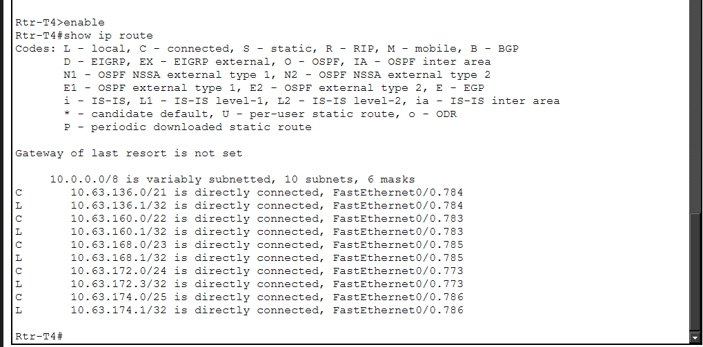
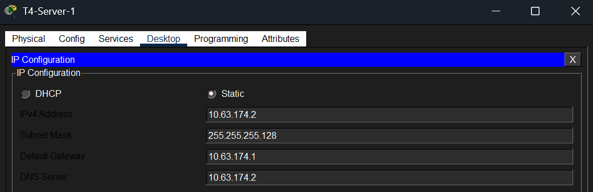
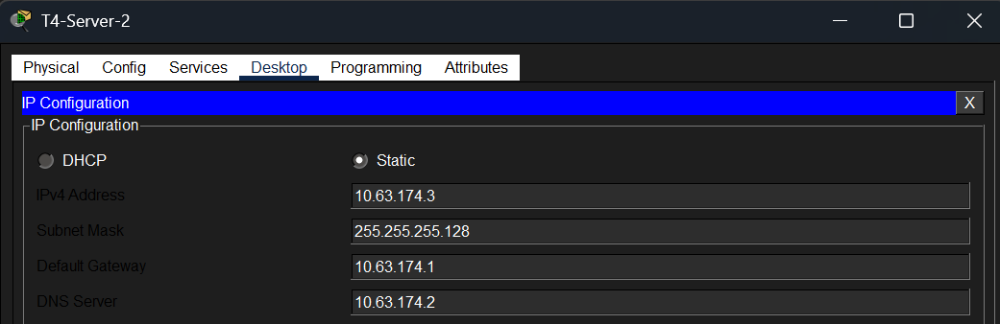
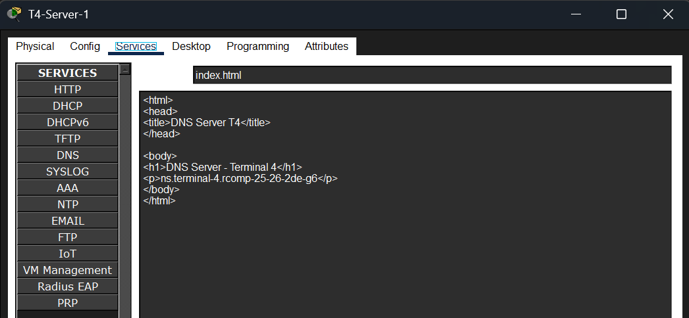
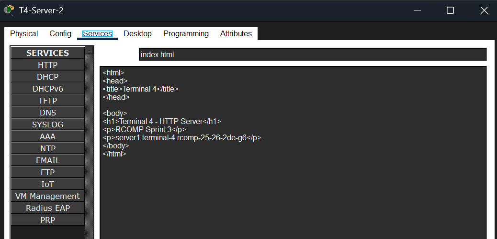
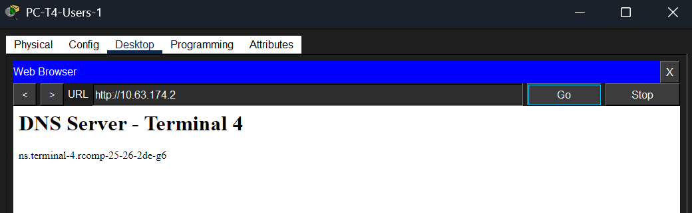
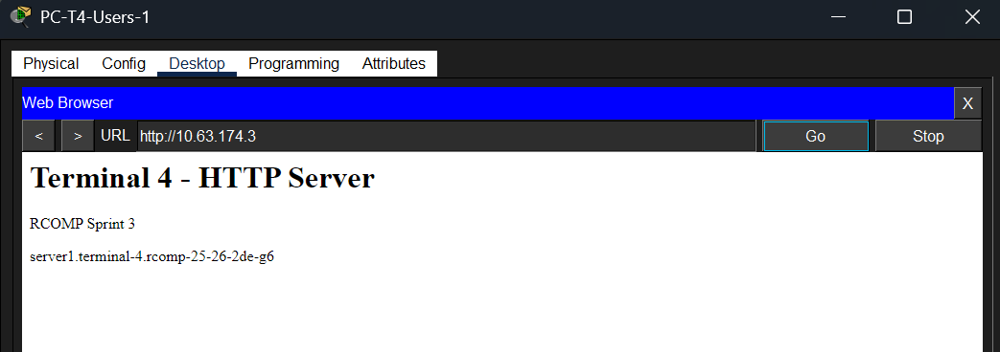

# RCOMP – Projeto 1 – Sprint 3 – 1240895
## Terminal 4

---

## Dados de Referência – Terminal 4

| Parâmetro | Valor |
|---|---|
| OSPF Area ID | **Area 4** |
| VoIP Prefixo | **4** |
| Domínio DNS | **terminal-4.rcomp-25-26-2de-g6** |
| Servidor DNS (ns) IP | **10.63.174.2** |
| Servidor HTTP (server1) IP | **10.63.174.3** |
| Router T4 – IP Backbone | **10.63.172.3** |
| Router T4 – IP VoIP (gateway DHCP) | **10.63.168.1** |

### VLANs do Terminal 4

| VLAN | ID | Rede | Gateway |
|------|----|------|---------|
| T4-UserOutlets | 783 | 10.63.160.0/22 | 10.63.160.1 |
| T4-WiFi | 784 | 10.63.136.0/21 | 10.63.136.1 |
| T4-VoIP | 785 | 10.63.168.0/23 | 10.63.168.1 |
| T4-ServersDMZ | 786 | 10.63.174.0/25 | 10.63.174.1 |
| CampusBackbone | 773 | 10.63.172.0/24 | — |

---

# FASE 1 — Limpeza + base do OSPF

## 1.1 Remover routing estático

No router Rtr-T4:

```
enable
conf t
no ip route 10.63.128.0 255.255.248.0 10.63.172.1
no ip route 10.63.152.0 255.255.252.0 10.63.172.1
no ip route 10.63.166.0 255.255.254.0 10.63.172.1
no ip route 10.63.174.128 255.255.255.128 10.63.172.1

no ip route 10.63.144.0 255.255.248.0 10.63.172.2
no ip route 10.63.156.0 255.255.252.0 10.63.172.2
no ip route 10.63.170.0 255.255.254.0 10.63.172.2
no ip route 10.63.173.0 255.255.255.0 10.63.172.2

no ip route 0.0.0.0 0.0.0.0 10.63.172.1
```

> **Nota:** O T4 **não** mantém nenhuma rota estática. Apenas o T2 mantém a default route para o ISP.

## 1.2 Ativar OSPF no router T4

```
router ospf 1
 router-id 4.4.4.4
```

## 1.3 Anunciar redes do T4 no OSPF

```
! Backbone (area 0)
network 10.63.172.0 0.0.0.255 area 0

! T4-WiFi (/21)
network 10.63.136.0 0.0.7.255 area 4

! T4-UserOutlets (/22)
network 10.63.160.0 0.0.3.255 area 4

! T4-VoIP (/23)
network 10.63.168.0 0.0.1.255 area 4

! T4-ServersDMZ (/25)
network 10.63.174.0 0.0.0.127 area 4
```

**Nota:**
- VLAN 773 (backbone) → area 0
- resto do T4 → area 4

## 1.4 Verificações

```
show ip protocols
show ip ospf neighbor
show ip ospf database
show ip route ospf
show ip route
show ip ospf interface brief
```

Output do `show ip route` após configuração (T2 e T3 ainda sem OSPF ativo — só rotas C do próprio T4):



---

# FASE 2 — Preparar Servidores na DMZ

## 2.1 Servidor DNS (ns) — T4-Server-1

**Na VLAN 786:**
- T4-Server-1 → servidor DNS (ns) — já existia do Sprint 2
- T4-Server-2 → servidor HTTP (server1) — já existia do Sprint 2

**Configuração do T4-Server-1 (ns):**
- IP fixo: 10.63.174.2
- Máscara: 255.255.255.128
- Gateway: 10.63.174.1
- DNS: 10.63.174.2 (ele próprio)

NS IP CONFIG:



SERVER1 IP CONFIG:



## 2.2 Ativar HTTP/HTTPS nos servidores

### T4-Server-1 (ns, 10.63.174.2)
- Services → HTTP → ON
- Services → HTTPS → ON
- Services → DNS → ON 

Editamos o index.html do servidor DNS:



```html
<html>
<head>
<title>DNS Server T4</title>
</head>
<body>
<h1>DNS Server - Terminal 4</h1>
<p>ns.terminal-4.rcomp-25-26-2de-g6</p>
</body>
</html>
```

### T4-Server-2 (server1, 10.63.174.3)
- Services → HTTP → ON
- Services → HTTPS → ON

Editamos o index.html do servidor HTTP:



```html
<html>
<head>
<title>Terminal 4</title>
</head>
<body>
<h1>Terminal 4 - HTTP Server</h1>
<p>RCOMP Sprint 3</p>
<p>server1.terminal-4.rcomp-25-26-2de-g6</p>
</body>
</html>
```

## 2.3 Verificações

Para verificar a conectividade aos servidores, fizemos ping no CLI do Rtr-T4:

```
ping 10.63.174.2
ping 10.63.174.3
```

Ambos respondem com 80% de sucesso (perda do 1º pacote por ARP — comportamento normal no Packet Tracer).

Para confirmar as páginas HTTP, acedemos via Web Browser a partir do PC-T4-Users-1 (IP temporário estático 10.63.160.11):

```
http://10.63.174.2
http://10.63.174.3
```

Página do servidor DNS (ns):



Página do servidor HTTP (server1):

