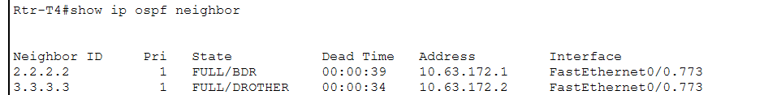
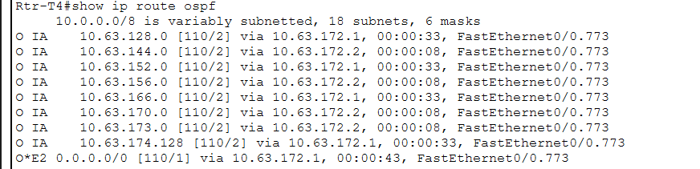
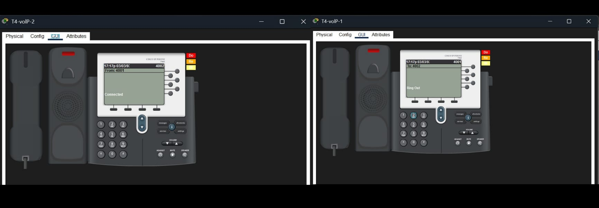
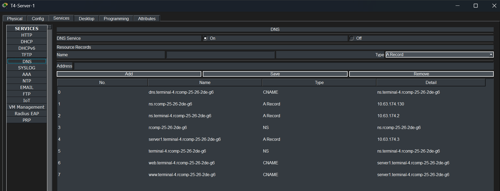
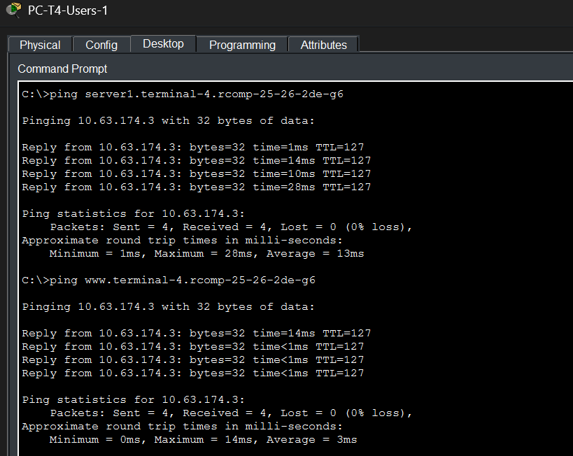
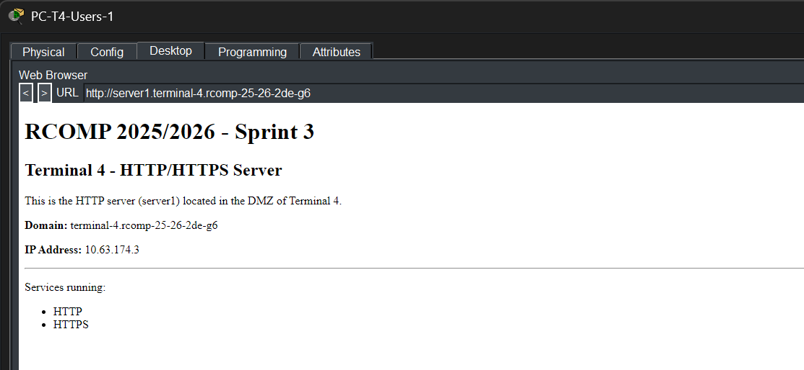
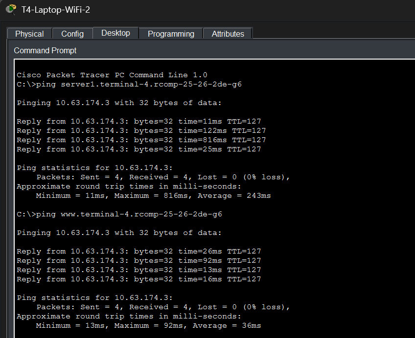
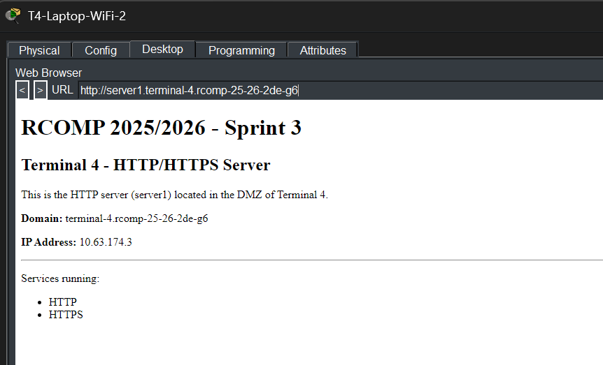
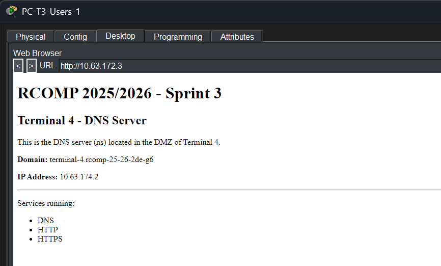

# RCOMP – Projeto 1 – Sprint 3 – 1240895
## Terminal 4

---

## Dados de Referência – Terminal 4

| Parâmetro | Valor |
|---|---|
| OSPF Area ID | **Area 4** |
| VoIP Prefixo | **4** |
| Domínio DNS | **terminal-4.rcomp-25-26-2de-g6** |
| Servidor DNS (ns) IP | **10.63.174.2** |
| Servidor HTTP (server1) IP | **10.63.174.3** |
| Router T4 – IP Backbone | **10.63.172.3** |
| Router T4 – IP VoIP (gateway DHCP) | **10.63.168.1** |

### VLANs do Terminal 4

| VLAN | ID | Rede | Gateway |
|------|----|------|---------|
| T4-UserOutlets | 783 | 10.63.160.0/22 | 10.63.160.1 |
| T4-WiFi | 784 | 10.63.136.0/21 | 10.63.136.1 |
| T4-VoIP | 785 | 10.63.168.0/23 | 10.63.168.1 |
| T4-ServersDMZ | 786 | 10.63.174.0/25 | 10.63.174.1 |
| CampusBackbone | 773 | 10.63.172.0/24 | — |

---

# FASE 1 — Limpeza + base do OSPF

## 1.1 Remover routing estático

No router Rtr-T4:

```
enable
conf t
no ip route 10.63.128.0 255.255.248.0 10.63.172.1
no ip route 10.63.152.0 255.255.252.0 10.63.172.1
no ip route 10.63.166.0 255.255.254.0 10.63.172.1
no ip route 10.63.174.128 255.255.255.128 10.63.172.1

no ip route 10.63.144.0 255.255.248.0 10.63.172.2
no ip route 10.63.156.0 255.255.252.0 10.63.172.2
no ip route 10.63.170.0 255.255.254.0 10.63.172.2
no ip route 10.63.173.0 255.255.255.0 10.63.172.2

no ip route 0.0.0.0 0.0.0.0 10.63.172.1
```

> **Nota:** O T4 **não** mantém nenhuma rota estática. Apenas o T2 mantém a default route para o ISP.

## 1.2 Ativar OSPF no router T4

```
router ospf 1
 router-id 4.4.4.4
```

## 1.3 Anunciar redes do T4 no OSPF

```
! Backbone (area 0)
network 10.63.172.0 0.0.0.255 area 0

! T4-WiFi (/21)
network 10.63.136.0 0.0.7.255 area 4

! T4-UserOutlets (/22)
network 10.63.160.0 0.0.3.255 area 4

! T4-VoIP (/23)
network 10.63.168.0 0.0.1.255 area 4

! T4-ServersDMZ (/25)
network 10.63.174.0 0.0.0.127 area 4
```

**Nota:**
- VLAN 773 (backbone) → area 0
- resto do T4 → area 4

## 1.4 Verificações

```
show ip protocols
show ip ospf neighbor
show ip ospf database
show ip route ospf
show ip route
show ip ospf interface brief
```

Output do `show ip route` após configuração (T2 e T3 ainda sem OSPF ativo — só rotas C do próprio T4):


## 1.5 Configurações OSPF nos routers T2 e T3

De acordo com o enunciado, cada membro deve também converter os routers dos outros terminais de static routing para OSPF, sem alterar mais nada neles.

### No Rtr-T2:

```
enable
conf t
no ip route 10.63.144.0 255.255.248.0 10.63.172.2
no ip route 10.63.156.0 255.255.252.0 10.63.172.2
no ip route 10.63.170.0 255.255.254.0 10.63.172.2
no ip route 10.63.173.0 255.255.255.0 10.63.172.2
no ip route 10.63.136.0 255.255.248.0 10.63.172.3
no ip route 10.63.160.0 255.255.252.0 10.63.172.3
no ip route 10.63.168.0 255.255.254.0 10.63.172.3
no ip route 10.63.174.0 255.255.255.128 10.63.172.3

router ospf 1
 router-id 2.2.2.2
 network 10.63.172.0 0.0.0.255 area 0
 network 10.63.128.0 0.0.7.255 area 2
 network 10.63.152.0 0.0.3.255 area 2
 network 10.63.166.0 0.0.1.255 area 2
 network 10.63.174.128 0.0.0.127 area 2
 default-information originate
end
write
```

### No Rtr-T3:

```
enable
conf t
no ip route 10.63.128.0 255.255.248.0 10.63.172.1
no ip route 10.63.152.0 255.255.252.0 10.63.172.1
no ip route 10.63.166.0 255.255.254.0 10.63.172.1
no ip route 10.63.174.128 255.255.255.128 10.63.172.1
no ip route 10.63.136.0 255.255.248.0 10.63.172.3
no ip route 10.63.160.0 255.255.252.0 10.63.172.3
no ip route 10.63.168.0 255.255.254.0 10.63.172.3
no ip route 10.63.174.0 255.255.255.128 10.63.172.3
no ip route 0.0.0.0 0.0.0.0 10.63.172.1

router ospf 1
 router-id 3.3.3.3
 network 10.63.172.0 0.0.0.255 area 0
 network 10.63.144.0 0.0.7.255 area 3
 network 10.63.156.0 0.0.3.255 area 3
 network 10.63.170.0 0.0.1.255 area 3
 network 10.63.173.0 0.0.0.255 area 3
end
write
```

## 1.6 Verificações finais OSPF (após configurar T2 e T3)

```
show ip ospf neighbor
show ip route ospf
```

Output do `show ip ospf neighbor` — os três routers como vizinhos OSPF:



Output do `show ip route ospf` — rotas do T2 e T3 aprendidas via OSPF:



---

# FASE 2 — Preparar Servidores na DMZ

## 2.1 Servidor DNS (ns) — T4-Server-1

**Na VLAN 786:**
- T4-Server-1 → servidor DNS (ns) — já existia do Sprint 2
- T4-Server-2 → servidor HTTP (server1) — já existia do Sprint 2

**Configuração do T4-Server-1 (ns):**
- IP fixo: 10.63.174.2
- Máscara: 255.255.255.128
- Gateway: 10.63.174.1
- DNS: 10.63.174.2 (ele próprio)

NS IP CONFIG:


SERVER1 IP CONFIG:


## 2.2 Ativar HTTP/HTTPS nos servidores

### T4-Server-1 (ns, 10.63.174.2)
- Services → HTTP → ON
- Services → HTTPS → ON
- Services → DNS → ON (já ativo do Sprint 2)

Editamos o index.html do servidor DNS:


```html
<!DOCTYPE html>
<html>
<head>
    <title>Terminal 4 - RCOMP</title>
</head>
<body>
    <h1>RCOMP 2025/2026 - Sprint 3</h1>

    <h2>Terminal 4 - DNS Server</h2>

    <p>This is the DNS server (ns) located in the DMZ of Terminal 4.</p>

    <p><b>Domain:</b> terminal-4.rcomp-25-26-2de-g6</p>
    <p><b>IP Address:</b> 10.63.174.2</p>

    <hr>

    <p>Services running:</p>
    <ul>
        <li>DNS</li>
        <li>HTTP</li>
        <li>HTTPS</li>
    </ul>
</body>
</html>
```

### T4-Server-2 (server1, 10.63.174.3)
- Services → HTTP → ON
- Services → HTTPS → ON

Editamos o index.html do servidor HTTP:


```html
<!DOCTYPE html>
<html>
<head>
    <title>Terminal 4 - RCOMP</title>
</head>
<body>
    <h1>RCOMP 2025/2026 - Sprint 3</h1>

    <h2>Terminal 4 - HTTP/HTTPS Server</h2>

    <p>This is the HTTP server (server1) located in the DMZ of Terminal 4.</p>

    <p><b>Domain:</b> terminal-4.rcomp-25-26-2de-g6</p>
    <p><b>IP Address:</b> 10.63.174.3</p>

    <hr>

    <p>Services running:</p>
    <ul>
        <li>HTTP</li>
        <li>HTTPS</li>
    </ul>
</body>
</html>
```

## 2.3 Verificações

Para verificar a conectividade aos servidores, fizemos ping no CLI do Rtr-T4:

```
ping 10.63.174.2
ping 10.63.174.3
```

Ambos respondem com 80% de sucesso (perda do 1º pacote por ARP — comportamento normal no Packet Tracer).

Para confirmar as páginas HTTP, acedemos via Web Browser a partir do PC-T4-Users-1 (IP temporário estático 10.63.160.11):

```
http://10.63.174.2
http://10.63.174.3
```

Página do servidor DNS (ns):


Página do servidor HTTP (server1):


---

# FASE 3 — DHCPv4

## 3.1 Criar pools no router T4

### Exclusões globais (IPs reservados para dispositivos estáticos)

```
ip dhcp excluded-address 10.63.160.1 10.63.160.10
ip dhcp excluded-address 10.63.136.1 10.63.136.10
ip dhcp excluded-address 10.63.168.1 10.63.168.10
```

Foram configuradas exclusões de endereços IPv4 no serviço DHCP de forma a impedir a atribuição dinâmica de endereços reservados para dispositivos configurados manualmente.
Os intervalos excluídos correspondem aos primeiros endereços de cada VLAN, utilizados por interfaces do router (default gateways) e equipamentos de infraestrutura com configuração estática.
Esta abordagem evita conflitos de endereçamento IP entre clientes DHCP e dispositivos estáticos, garantindo maior estabilidade e organização da rede.

## 3.2 Pool UserOutlets (VLAN 783)

```
ip dhcp pool T4-UserOutlets
 network 10.63.160.0 255.255.252.0
 default-router 10.63.160.1
 dns-server 10.63.174.2
 domain-name terminal-4.rcomp-25-26-2de-g6
```

## 3.3 Pool WiFi (VLAN 784)

```
ip dhcp pool T4-WiFi
 network 10.63.136.0 255.255.248.0
 default-router 10.63.136.1
 dns-server 10.63.174.2
 domain-name terminal-4.rcomp-25-26-2de-g6
```

## 3.4 Pool VoIP (VLAN 785)

```
ip dhcp pool T4-VoIP
 network 10.63.168.0 255.255.254.0
 default-router 10.63.168.1
 option 150 ip 10.63.168.1
```

## 3.5 Configurar os clientes

- Ir a cada PC e Laptop do terminal e mudar a configuração de IP de "Static" para "DHCP"
- Os servidores na DMZ e equipamentos de infraestrutura mantêm IP estático

## 3.6 Verificações

1. DHCP service ativo no router:
```
show running-config | section dhcp
```

2. Clientes em DHCP — nos PCs/Laptops: Desktop → IP Configuration → DHCP
```
ipconfig
```

3. Ver leases DHCP atribuídos:
```
show ip dhcp binding
```

4. Pings de confirmação (a partir de PC-T4-Users-1):
```
ping 10.63.160.1
ping 10.63.174.2
ping 10.63.174.3
```

---

# FASE 4 — VoIP (Call Manager no router)

Adicionar/confirmar 2 telefones IP (modelo 7960). O T4-VoIP-1 já existia do Sprint 2.

## 4.1 Configurar CME no router T4

```
enable
conf t

telephony-service
 max-ephones 10
 max-dn 10
 ip source-address 10.63.168.1 port 2000
 auto assign 1 to 2

ephone-dn 1
 number 4001

ephone-dn 2
 number 4002
```

## 4.2 Configurar encaminhamento entre terminais (Dial-Peers)

```
dial-peer voice 2 voip
 destination-pattern 2...
 session target ipv4:10.63.172.1

dial-peer voice 3 voip
 destination-pattern 3...
 session target ipv4:10.63.172.2
```

### O que isto faz

`destination-pattern 2...` significa: qualquer número de 4 dígitos começado por 2 (ex: 2001, 2123) vai para o T2.

`destination-pattern 3...` significa: qualquer número de 4 dígitos começado por 3 vai para o T3.

`session target` define o router destino via backbone VLAN 773:
- T2 → 10.63.172.1
- T3 → 10.63.172.2

## 4.3 Configurar portas do switch para IP phones 7960

O telefone T4-VoIP-1 está ligado ao **CP-T4-L0-Sala14** na porta Fa4/1.
O telefone T4-VoIP-2 está ligado ao **CP-T4-L2-Sala14/15** na porta Fa5/1.

```
! CP-T4-L0-Sala14
interface FastEthernet4/1
 no switchport access vlan
 switchport voice vlan 785

! CP-T4-L2-Sala14/15
interface FastEthernet5/1
 switchport mode access
 no switchport access vlan
 switchport voice vlan 785
```

## 4.4 DHCP para VoIP

Do passo anterior (3) já foi configurado:

```
option 150 ip 10.63.168.1
```

Isto permite ao telefone obter IP, descarregar a configuração do CME e registar-se no router.

## 4.5 Verificações

Ver telefones registados:

```
show ephone
```

Ambos os telefones aparecem como **REGISTERED**:
- ephone-1: 10.63.168.12 → número **4001**
- ephone-2: 10.63.168.11 → número **4002**

Teste de chamada entre os dois telefones (4001 → 4002) com sucesso:



# FASE 5 — DNS (Subdomain no T4)
No server DNS (10.63.174.2):
Todos os clientes DHCP são configurados para usar o servidor DNS local (10.63.174.2) e o nome de domínio terminal-4.rcomp-25-26-2de-g6 automaticamente por meio da configuração DHCP.

## 5.1 Configuração do servidor DNS
Nome do servidor:
ns.terminal-4.rcomp-25-26-2de-g6
IP:
10.63.174.2

## 5.2 Registos obrigatórios:
Ir ao:
Server → Services → DNS → ON
Adicionar os seguintes registos:

### A Records
| Name                                   | Address       |
| -------------------------------------- | ------------- |
| ns.terminal-4.rcomp-25-26-2de-g6      | 10.63.174.2   |
| server1.terminal-4.rcomp-25-26-2de-g6 | 10.63.174.3   |

### CNAME Records
| Name                                   | Canonical Name                         |
| -------------------------------------- | -------------------------------------- |
| www.terminal-4.rcomp-25-26-2de-g6     | server1.terminal-4.rcomp-25-26-2de-g6 |
| web.terminal-4.rcomp-25-26-2de-g6     | server1.terminal-4.rcomp-25-26-2de-g6 |
| dns.terminal-4.rcomp-25-26-2de-g6     | ns.terminal-4.rcomp-25-26-2de-g6      |

## 5.3 Glue Records

### Terminal 4 Ns
| Name                          | Name Server                       |
| ----------------------------- | --------------------------------- |
| terminal-4.rcomp-25-26-2de-g6 | ns.terminal-4.rcomp-25-26-2de-g6 |

### Glue A Record (root DNS)
| Name                   | Name Server           |
| ---------------------- | --------------------- |
| rcomp-25-26-2de-g6     | ns.rcomp-25-26-2de-g6 |

### Glue A Record (root IP)
| Name                   | Address        |
| ---------------------- | -------------- |
| ns.rcomp-25-26-2de-g6  | 10.63.174.130  |



## 5.4 Verificações
### Como verificar se o DNS funciona
Nos PCs/laptops:
Desktop → Command Prompt
Testes:

#### Resolver o servidor HTTP
ping server1.terminal-4.rcomp-25-26-2de-g6
Deve resolver para:
10.63.174.3

#### Testar alias www
ping www.terminal-4.rcomp-25-26-2de-g6
Também deve resolver para:
10.63.174.3

#### Abrir browser
No browser do PC:
http://server1.terminal-4.rcomp-25-26-2de-g6
ou
http://www.terminal-4.rcomp-25-26-2de-g6

Pings no pc das useroutlets:


Browser no pc das useroutlets:


Pings no laptop:


Browser no laptop:


# FASE 6 — NAT (só depois de DNS funcionar)

No router T4:

## 6.1 Interfaces NAT

### Inside

```
interface FastEthernet0/0.783
 ip nat inside

interface FastEthernet0/0.784
 ip nat inside

interface FastEthernet0/0.785
 ip nat inside

interface FastEthernet0/0.786
 ip nat inside
```

### Outside

```
interface FastEthernet0/0.773
 ip nat outside
```

## 6.2 NAT STATIC

O objetivo é:
✔ tráfego HTTP/HTTPS → IP do backbone → DNS server

### Redirecionamento de tráfego vindo do Backbone (VLAN 773) para o Servidor DNS

```
ip nat inside source static tcp 10.63.174.2 80 10.63.172.3 80
ip nat inside source static tcp 10.63.174.2 443 10.63.172.3 443
```

## 6.3 Servidor DNS (IMPORTANTE)

No servidor ns (10.63.174.2):
- Services → HTTP → ON
- Services → HTTPS → ON

### Página HTML (no DNS server)

Editamos o index.html do ns:


Para ver a página criada podemos ir ao laptop e pesquisar: http://10.63.174.2


## 6.4 Verificações

Teste 1 (interno)
http://10.63.174.2
(Deve aparecer a página do servidor DNS do T4.)

Teste 2 (DNS)
http://server1.terminal-4.rcomp-25-26-2de-g6
(Deve resolver o nome para .3 e mostrar a página do servidor HTTP dedicado.)

Teste 3 (browser)
http://www.terminal-4.rcomp-25-26-2de-g6
(Deve abrir a mesma página do Teste 2 (via CNAME).)

Teste 4 (Router):
No CLI do Router T4 — show ip nat translations para ver as traduções ativas durante os testes.

### Teste NAT com outros terminais

No browser do PC do Terminal 2 ou Terminal 3:
http://10.63.172.3

Resultado:

