# RCOMP – Projeto 1 – Sprint 2 - 1240914
## Terminal 2

---

# FASE 1 — Limpeza + base do OSPF

## 1.1 Remover routing estático (EXCETO default route)

No router T2:
enable
conf t
no ip route 10.63.144.0 255.255.248.0 10.63.172.2
no ip route 10.63.156.0 255.255.252.0 10.63.172.2
no ip route 10.63.170.0 255.255.254.0 10.63.172.2
no ip route 10.63.173.0 255.255.255.0 10.63.172.2

no ip route 10.63.136.0 255.255.248.0 10.63.172.3
no ip route 10.63.160.0 255.255.252.0 10.63.172.3
no ip route 10.63.168.0 255.255.254.0 10.63.172.3
no ip route 10.63.174.0 255.255.255.128 10.63.172.3

## 1.2 Ativar OSPF no router T2

router ospf 1
router-id 2.2.2.2

## 1.3 Anunciar redes do T2 no OSPF

### BackBone (area 0)
network 10.63.172.0 0.0.0.255 area 0

### T2-WiFi (/21 → 10.63.128.0)
network 10.63.128.0 0.0.7.255 area 2

### T2-UserOutlets (/22 → 10.63.152.0)
network 10.63.152.0 0.0.3.255 area 2

### T2-VoIP (/23 → 10.63.166.0)
network 10.63.166.0 0.0.1.255 area 2

### T2-ServersDMZ (/25 → 10.63.174.128)
network 10.63.174.128 0.0.0.127 area 2

**Nota:**
- VLAN 773 (backbone) → area 0
- resto do T2 → area 2

## 1.4 Default route no OSPF

default-information originate

## 1.5 Verificações

Ver se o OSPF está ativo: show ip protocols
Ver vizinhos OSPF: show ip ospf neighbor (depois de t3 e t4 terem ospf ativo)
Ver base de dados OSPF: show ip ospf database
Ver rotas aprendidas via OSPF: show ip route ospf
Ver tabela completa de routing: show ip route
Ver interfaces OSPF: show ip ospf interface brief

# FASE 2 — Preparar SERVIDORES (antes de DHCP e DNS)

## 2.1 Adicionar segundo servidor na DMZ (T2)

**Na VLAN 778:**
- server1 (nome ns) → já existe (DNS root + web depois) 
- server2 (nome server1) → NOVO (HTTP/HTTPS) 

**Configurar:**
- IP fixo: 10.63.174.131
- gateway: 10.63.174.129

NS IP CONFIG:
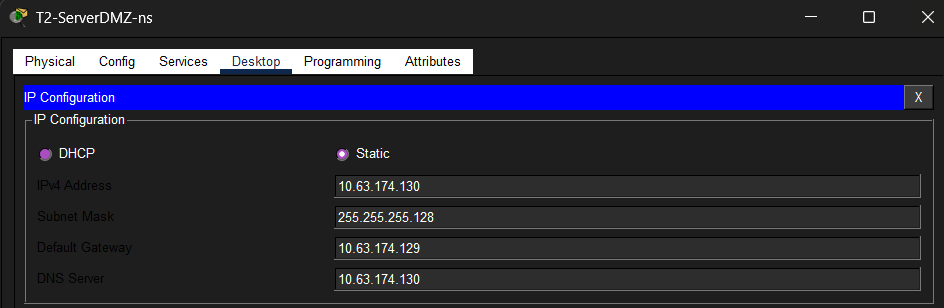

SERVER 1 IP CONFIG:
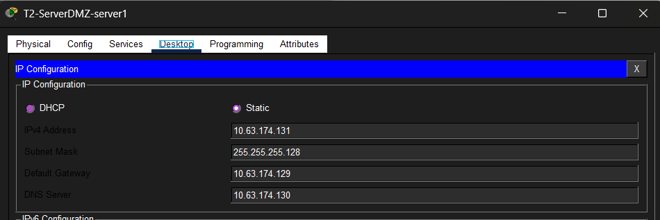

## 2.2 Ativar HTTP no server1
No Packet Tracer:
- Services → HTTP → ON
- Services → HTTPS → ON
- Criar página simples: “Terminal 2 - HTTP Server (Sprint 3)”

editamos o index.html do server1:
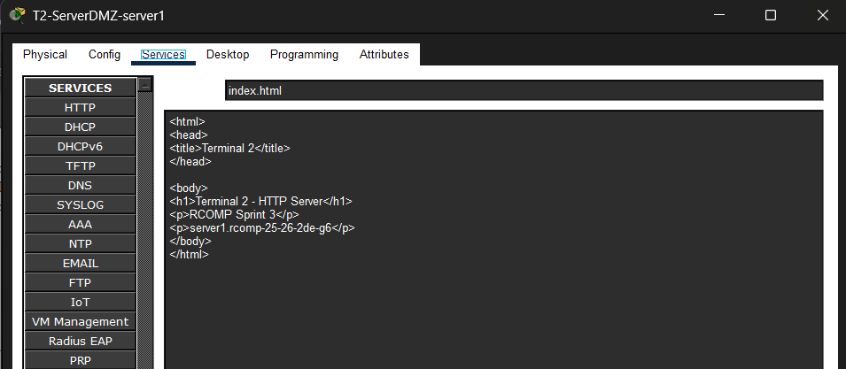

Para ver a página criado podemos ir ao laptop e pesquisar: http://10.63.174.131
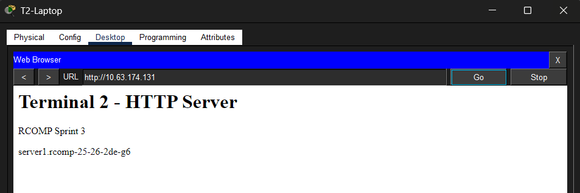

# FASE 3 — DHCP

## 3.1 Criar pools no router T2

## Exclusões globais (IPs do router e IPs reservados para dispositivos estáticos)
ip dhcp excluded-address 10.63.152.1 10.63.152.10
ip dhcp excluded-address 10.63.128.1 10.63.128.10
ip dhcp excluded-address 10.63.166.1 10.63.166.10

Foram configuradas exclusões de endereços IPv4 no serviço DHCP de forma a impedir a atribuição dinâmica de endereços reservados para dispositivos configurados manualmente.
Os intervalos excluídos correspondem aos primeiros endereços de cada VLAN, utilizados por:
- interfaces do router (default gateways),
- equipamentos de infraestrutura,
- dispositivos de gestão,
- e outros equipamentos com configuração estática.
Esta abordagem evita conflitos de endereçamento IP entre clientes DHCP e dispositivos estáticos, garantindo maior estabilidade e organização da rede.

## 3.1 Pool UserOutlets (VLAN 775)
ip dhcp pool T2-UserOutlets
network 10.63.152.0 255.255.252.0
default-router 10.63.152.1
dns-server 10.63.174.130
domain-name rcomp-25-26-2de-g6

## 3.2 Pool WiFi (VLAN 776)
ip dhcp pool T2-WiFi
network 10.63.128.0 255.255.248.0
default-router 10.63.128.1
dns-server 10.63.174.130
domain-name rcomp-25-26-2de-g6

## 3.3 Pool VoIP (VLAN 777)
ip dhcp pool T2-VoIP
network 10.63.166.0 255.255.254.0
default-router 10.63.166.1
dns-server 10.63.174.130
domain-name rcomp-25-26-2de-g6
option 150 ip 10.63.166.1

## 3.4 Nos dispositos:
- **Configurar os Clientes:** Ir a cada PC e Laptop do terminal e mudar a configuração de IP de "Static" para "DHCP" (menos no pc que esta na vlan 774 switchesdmz).
- **Verificar a Atribuição:** Confirmar que os dispositivos recebem um IP da gama correta, o Gateway correto e o IP do servidor DNS (.130).

## 3.5 Verificações
1. DHCP service ativo no router: no router T2- show running-config | section dhcp
2. Clientes em DHCP: Nos PCs/Laptops:
    Desktop → IP Configuration → DHCP: ipconfig
3. Ver leases DHCP: No router - show ip dhcp binding
4. Ping:
   Cliente → gateway
   ping 10.63.152.1
   Cliente → DNS server
   ping 10.63.174.130
   Cliente → HTTP server
   ping 10.63.174.131

# FASE 4 — VoIP (Call Manager no router)
Adicionar mais um VoIP. (2 no total)

## 4.1 Configurar CME no router T2
No router T2:

enable
conf t

telephony-service
max-ephones 10
max-dn 10
ip source-address 10.63.166.1 port 2000
auto assign 1 to 2

ephone-dn 1
number 2001

ephone-dn 2
number 2002

## 4.2 Configurar encaminhamento entre terminais (Dial-Peers)
No router T2:

dial-peer voice 3 voip
destination-pattern 3...
session target ipv4:10.63.172.2

dial-peer voice 4 voip
destination-pattern 4...
session target ipv4:10.63.172.3

### O que isto faz
`destination-pattern 3...`
Significa:
qualquer número de 4 dígitos começado por 3
ex:
- 3001
- 3123
- 3999
vai para o T3.

`session target`
Define o router destino:
- T3 → 10.63.172.2
- T4 → 10.63.172.3
via backbone VLAN 773.

## 4.3 Configurar portas do switch

No switch onde estão ligados os telefones:
telefone 1 → fa5/1
telefone 2 → fa2/1

enable
conf t

interface FastEthernet5/1
switchport mode access
no switchport access vlan
switchport voice vlan 777

interface FastEthernet2/1
switchport mode access
no switchport access vlan
switchport voice vlan 777

## 4.4 DHCP para VoIP
Do passo anteriro (3) já foi feito:
option 150 ip 10.63.166.1

Isto permite:
- telefone obter IP
- descarregar config do CME
- registar-se no router

## 4.5 Verificações
1. Ver telefones registados: No router - show ephone

# FASE 5 — DNS (ROOT no T2)
No server DNS (10.63.174.130):

## 5.1 Configuração do servidor DNS
Nome do servidor:
ns.rcomp-25-26-2de-g6
IP:
10.63.174.130

## 5.2 Registos obrigatórios:
Ir ao:
Server → Services → DNS → ON
Adicionar os seguintes registos:

### A Records
| Name                       | Address       |
| -------------------------- | ------------- |
| ns.rcomp-25-26-2de-g6      | 10.63.174.130 |
| server1.rcomp-25-26-2de-g6 | 10.63.174.131 |

### CNAME Records
| Name                         | Canonical Name             |
|------------------------------| -------------------------- |
| www.rcomp-25-26-2de-g6       | server1.rcomp-25-26-2de-g6 |
| web.rcomp-25-26-2de-g6       | server1.rcomp-25-26-2de-g6 |
| dns.rcomp-25-26-2de-g6       | ns.rcomp-25-26-2de-g6      |

## 5.3 Glue Records (T3 e T4)

### Terminal 3 Ns
| Name                          | Name Server                      |
| ----------------------------- | -------------------------------- |
| terminal-3.rcomp-25-26-2de-g6 | ns.terminal-3.rcomp-25-26-2de-g6 |

### Glue A Record
| Name                             | Address     |
| -------------------------------- | ----------- |
| ns.terminal-3.rcomp-25-26-2de-g6 | 10.63.173.2 |

### Terminal 4 Ns
| Name                          | Name Server                      |
| ----------------------------- | -------------------------------- |
| terminal-4.rcomp-25-26-2de-g6 | ns.terminal-4.rcomp-25-26-2de-g6 |

### Glue A Record
| Name                             | Address     |
| -------------------------------- | ----------- |
| ns.terminal-4.rcomp-25-26-2de-g6 | 10.63.174.2 |

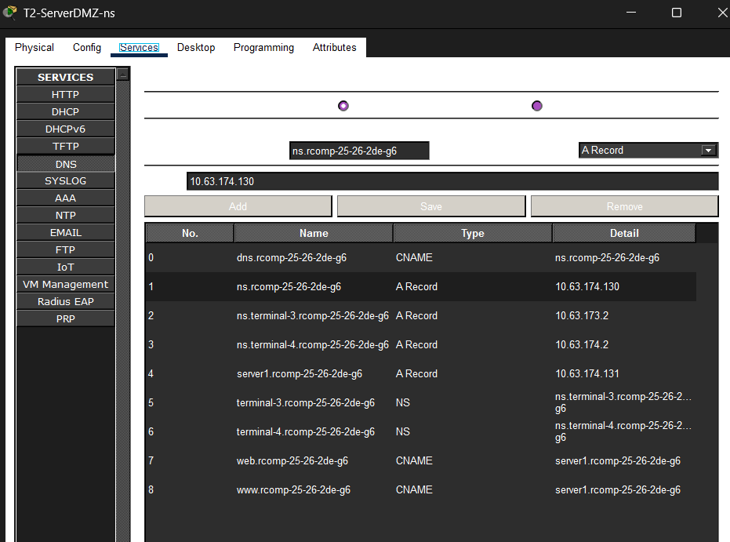

## 5.4 Verificações
### Como verificar se o DNS funciona
Nos PCs/laptops:
Desktop → Command Prompt
Testes:

#### Resolver o servidor HTTP
ping server1.rcomp-25-26-2de-g6
Deve resolver para:
10.63.174.131

#### Testar alias www
ping www.rcomp-25-26-2de-g6
Também deve resolver para:
10.63.174.131

#### Abrir browser
No browser do PC:
http://server1.rcomp-25-26-2de-g6
ou
http://www.rcomp-25-26-2de-g6

Pings no pc das useroutlets:
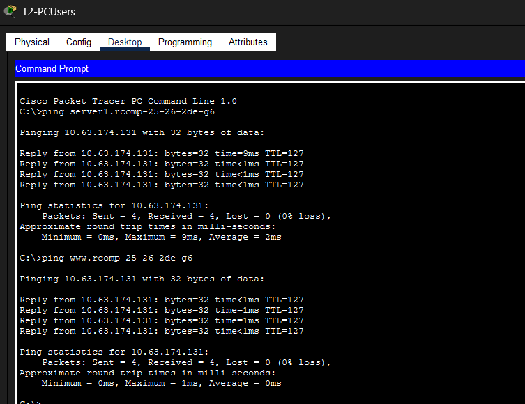

Browser no pc das useroutlets:
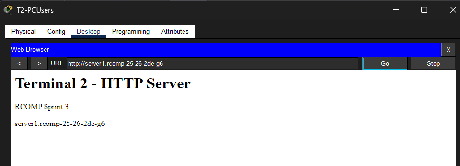

Pings no laptop:
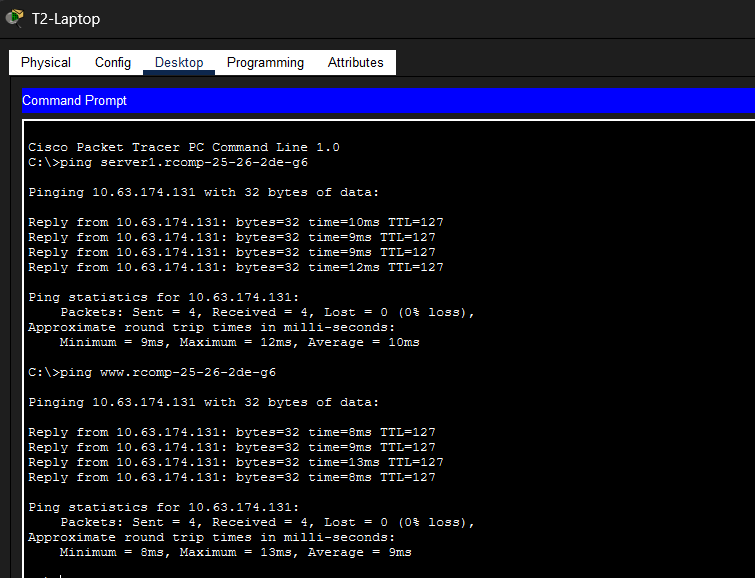

Browser no laptop:
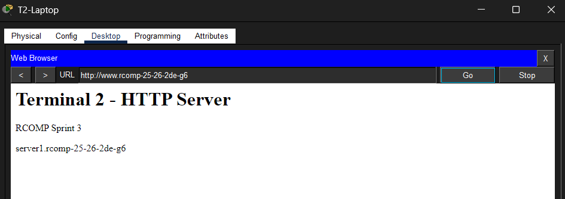

# FASE 6 — NAT (só depois de DNS funcionar)
No router T2:

## 6.1 Interfaces NAT
### Inside (todas as redes do campus)
interface fa0/0.775
ip nat inside
interface fa0/0.776
ip nat inside
interface fa0/0.777
ip nat inside
interface fa0/0.778
ip nat inside

### Outside (apenas ISP)
interface fa0/0.773
ip nat outside
interface fa0/1
ip nat outside

## 6.2 NAT STATIC 
O objetivo é:
✔ tráfego HTTP/HTTPS → IP do backbone → DNS server

### ver esta parte
### Redirecionamento de tráfego vindo do Backbone (VLAN 773) para o Servidor DNS  
ip nat inside source static tcp 10.63.174.130 80 10.63.172.1 80
ip nat inside source static tcp 10.63.174.130 443 10.63.172.1 443

## 6.3 Servidor DNS (IMPORTANTE)
No servidor ns:
10.63.174.130
Ativar:
Services → HTTP → ON
Services → HTTPS → ON

### Página HTML (no DNS server)
editamos o index.html do ns:
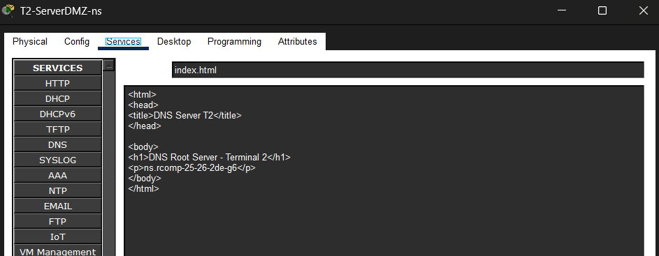

Para ver a página criado podemos ir ao laptop e pesquisar: http://10.63.174.130
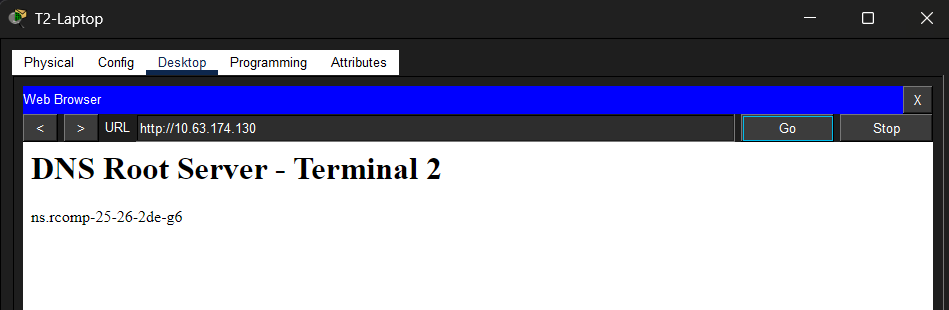

## 6.4 Verificações
Teste 1 (interno)
http://10.63.174.130
(Deve aparecer a página do servidor DNS do T2.)
Teste Nat
http://10.63.172.1
Teste 2 (DNS)
http://server1.rcomp-25-26-2de-g6
(Deve resolver o nome para .131 e mostrar a página do servidor HTTP dedicado.)
Teste 3 (browser)
www.rcomp-25-26-2de-g6
(Deve abrir a mesma página do Teste 2 (via CNAME).)
Teste 4 (Router): 
No CLI do Router T2- show ip nat translations para ver as traduções ativas durante os testes.

# FASE 7 — ACLs
Aqui vai-se aplicar regras em ordem:

## 7.1 Anti spoofing

## 7.2 ICMP allow

## 7.3 DMZ rules

## 7.4 Router protection

## 7.5 Allow rest

